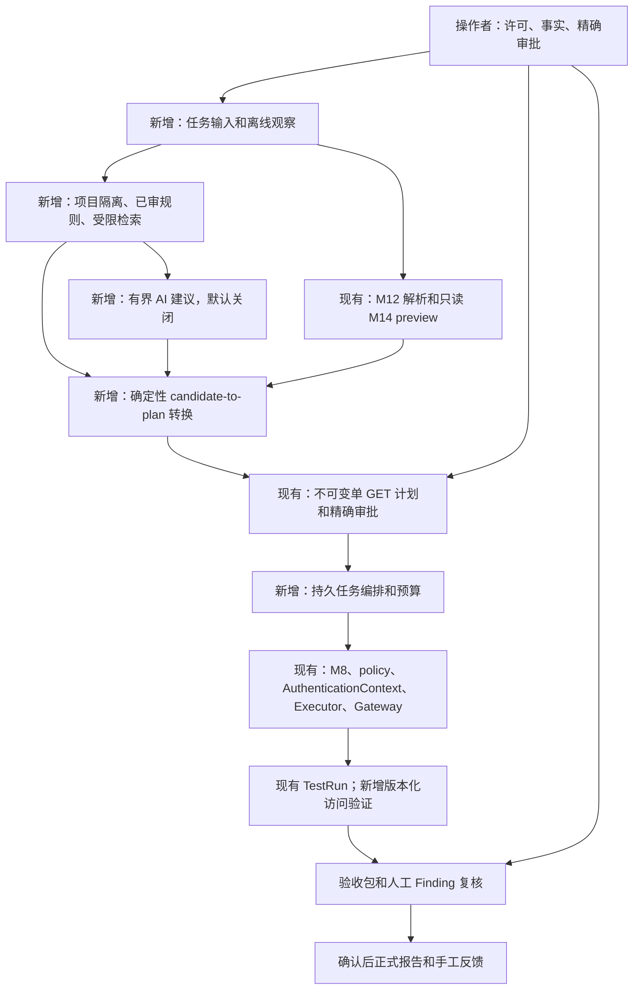

# Research Assistant v1 — 低人工参与、低 Token 的授权安全研究助手

> **RA-04/W2 current implementation record:** verified clean main `c4d6750eb42af5556036419980a0eb312f892d78`; branch `codex/ra-04-w2-response-verification`. The current handoff records W1 independent review and PR #144 integration. Under adopted I1–I7, [W2 verification and exact dispatch](research-response-verification.md) implements bounded session/object/denial interpretation, genuine platform health provenance, exact pairing and versioned uncertainty. **IMPLEMENTED / PENDING_INDEPENDENT_REVIEW**; RA-04 remains IN_PROGRESS, W3 is not started. Local synthetic tests confer no deployment/credential/data/spending approval. Issue #132 remains closed; no new milestone, push or PR. The W1 and earlier records below preserve their historical scope/status.

> **RA-04/W1 当前实现记录：** 本地核验clean main及origin/main均为 `59390a480db133db9411908af05df37dd625fc91`（PR #143集成提案；main push CI通过来自用户交接，未在本包重新查询远端CI），创建 `codex/ra-04-w1-intent-bridge`。操作者/Review Project Tech Lead采纳INTENT v0.1.0、reviewed `6723cb5bfa62a10453f18f8158c25000a1997711` 的I1–I7；采纳记录见[协议](research-intent-contract.md#i1i7-后续采纳与-w1-实施记录)。[W1转换实施与验证](research-intent-bridge.md)为 **IMPLEMENTED / PENDING_INDEPENDENT_REVIEW**，RA-04 IN_PROGRESS。新purpose的生产转换缺W2解释/健康证明时拒绝，审批/执行保持关闭；未产生部署Target/health流量、未访问operator credentials或私有材料。W2解释器/实际配对时间、W3演示未实施；不代签独立review PASS、W1验收完成或RA-04 COMPLETE。本地commit后STOP，不push/PR/merge或开始W2，等待Review Project。Issue #132保持关闭，不新增milestone。

> **RA-04/W1 历史文档准备记录：** 本地核验clean `main` 为 `bedc55395d2e5abf3479026fd201430b537baff2`，从此创建 `codex/ra-04-w1-intent-contract`。用户交接确认 RA-03/W3 reviewed `91db91f59761b5683309062d9b7ac51536bfe75f` 已经 PR #142 集成、main验证 **2790 passed**；本包静态核对本地提交历史，不重跑该suite或代签RA-03 COMPLETE。操作者明确选择先准备 [INTENT协议与兼容性建议 v0.1.0](research-intent-contract.md)，属于既有RA-04/W1，**DOCUMENTATION_ONLY / PENDING_INDEPENDENT_REVIEW**；I1–I7全部 **PROPOSED / PENDING_APPROVAL**，bridge未实施，W1/RA-04未完成。仅改三份文档，验证与限制见提案§8；无数据库/网络/凭据操作。Planning Issue #132保持关闭，不创建新milestone；本地commit后STOP，等待Review Project与必要operator/Tech Lead决定，不push/PR/merge或开始另一包。以下包内禁止开始后续工作的记录保留为当时历史，不撤销当前文档准备授权。

> **RA-03/W3 历史实施记录：** 本地核验clean main为 `cd60493cafc1d8bdcbf57cea84638d3138b3e78b`，从此新建 `codex/ra-03-w3-rule-validation`。用户交接确认W2 reviewed `69b6713ecbaadfcf3d23219953460e786b34463e` 已经PR #141合并、main验证2690 passed。[W3独立规则验证与反馈审核](research-rule-validation.md)实施有界离线正反例检查、不可变证据、反馈人工审核及真实证明加另一次显式publish gate；未进行实际规则发布。W3 IMPLEMENTED / PENDING_INDEPENDENT_REVIEW，RA-03 IN_PROGRESS；不代签reviewer PASS或stage COMPLETE。Planning Issue #132保持关闭；本地commit后停止，不push/PR/merge，不开始RA-04。

> **RA-03/W2 历史实施记录：** 用户交接确认 W1 经 PR #140 集成；fetch 后核验 clean main、origin/main 均为 `dcf3ec044157bb7db816368d5b7683a1b7edfb1d`，新分支 `codex/ra-03-w2-knowledge-retrieval` 从此开始。[K1–K4 后续采纳记录](research-knowledge-contract.md#k1k4-后续采纳记录ra-03w2) 与 [W2 有界检索实施记录](research-knowledge-retrieval.md) 记录本次范围、实际验证与限制。W2 IMPLEMENTED / PENDING_INDEPENDENT_REVIEW，最终全量回归有1项M8计时断言失败待复核（见实施记录），RA-03 IN_PROGRESS；普通 publication 关闭，W3 未开始，不宣告 reviewer-PASS 或 stage COMPLETE。旧 pending/NOT_AUTHORIZED 记录保留为当时历史。本地 commit 后停止，不 push。

> **RA-03/W1 历史实施记录：** 用户交接确认 RA-02/W3 已通过独立 review 及 exact-SHA push；本次 fetch 核验 `origin/codex/ra-02-w3-identity-resource-context` 与本地 HEAD 均为 `4ac9b284029a515766d7532a0381be86bea7ce09`，未合入 main。[W1 知识分类、版本与人工审核发布契约 v0.1.0](research-knowledge-contract.md) 已形成、待独立审查；分类/复用决定仍待明确批准，依赖 migration 前须通过。RA-03 IN_PROGRESS，未实现知识持久化/发布/检索；不签署 reviewer-PASS 或 stage COMPLETE。本次只做 W1，本地 commit 后停止，不 push、不开始 W2。下方 NOT_AUTHORIZED 与各包 pending 记录保留为当时历史，不覆盖本次交接。

> **RA-02/W3 历史实施记录：** 依据用户交接，W2 已通过独立审阅及 exact-SHA push，基线为 `e4f4de9ebb230b7dcde9d696bbfb8d731c6f283c`；本次 fetch 核验 `origin/codex/ra-02-w2-observation-intake`，未合入 main。[W3 身份/Resource/slot 与事实上下文](research-subject-context.md) 已实施、待独立审查；仅合成提议与缺项，不创建 intent/plan、不验证会话或执行。RA-02 仍 IN_PROGRESS，不签署 reviewer-PASS 或 stage COMPLETE；本地 commit 后停止，不 push、不开始后续包。下方为历史记录。

**PROPOSED / FOR REVIEW** · 2026-09-09 · [Issue #132](https://github.com/runyiy/ai-api-security-platform/issues/132)

> **RA-02/W2 历史实施记录（2026-09-10）：** W1 已独立审阅并 push 精确 HEAD `2575a34270fc53bddc75373afe220ba06a34883e`，本次 fetch 核验，未合入 main。[W2 bounded observation intake](research-observation-intake.md) 已实施、待独立审查；仅合成离线导入、资格/隔离及适用生命周期，无私有数据准入、网络/凭据/执行或 export。RA-02 IN_PROGRESS，W3 未开始；不签署 reviewer-PASS 或 stage COMPLETE。本次仅本地 commit 后停止，不 push。下方记录保留当时历史。

> **RA-02/W1 历史实施记录（2026-09-10）：** 本包基于 reviewed W3 HEAD `dcdb50fd36c098173c2580389577bb59558c0982`（本次 fetch 核验）；操作者采纳 DATA D1–D4、Tech Lead 采用其为设计约束的交接证据已记入 [DATA 后续决定](research-assistant-adr-decisions.md#data-后续决定记录ra-02w1)。[W1 synthetic intake context](research-intake-context.md) 已实施、待独立审查；仅元数据输入/准备度，零网络/凭据/执行，无私有资料准入。RA-02 IN_PROGRESS，W2/W3 未开始；不以本包签署 RA-01 stage exit、W1 reviewer-PASS 或 RA-02 COMPLETE。实施、验证、本地 commit 后停止，由 Review Project 审查；不 push。下方 W3 pending 和历史 NOT_AUTHORIZED 记录不替代后续明确交接。

> **RA-01 历史实施记录（2026-09-09）：** 用户交接确认 W1/W2 已通过独立审阅及 exact-SHA push；W2 精确 HEAD 为 `ac9a5ce3142232e86576b5d789d93b95508e259d`，本次 fetch 已核验，尚未合入 main。既有 [W1 契约](research-assistant-product-contract.md) 与 [W2 评测契约](research-assistant-evaluation.md) 保留各自当时记录；工程 gate 不代表标签、阈值、预算或 ADR 已获批准。[W3 ADR 决策材料 v0.1.0](research-assistant-adr-decisions.md) 已形成、待独立审查（**IMPLEMENTED / PENDING_INDEPENDENT_REVIEW**）；全部新架构建议及 RA-02 DATA 前置审批仍为 PENDING。RA-01 继续 IN_PROGRESS，未 COMPLETE，未启动 RA-02。下文 NOT_STARTED / NOT_AUTHORIZED、Issue #132 和 push 流程保留为规划历史；本次仅 W3：实施、验证、本地 commit 后停止，由独立 Review Project 审查并 push 精确批准的 HEAD。持续授权不替代架构决定、公网执行或费用批准；不重开 Issue #132 / merged PR #133。

**原始规划总状态（历史；后续包状态以页首记录及第5节为准）：** 本文是待审计划，不代表功能已经实现或获得执行许可。所有未来阶段和工作包均为 **NOT_STARTED / NOT_AUTHORIZED**。除明确标为历史证据或本次文档任务验证的记录外，下文 PASS 均表示未来验收条件。计划书合并不等于批准 RA-01，也不启动 M15。M14-01 至 M14-06 的约定离线范围保持 COMPLETE。

[架构决策](architecture-decisions.md)和[安全模型](security-model.md)继续具有规范优先级。发生冲突时，停止依赖工作，等待明确的架构决策；本计划不能静默修改这两份文档。下文新增的组件、状态、版本和工作包名称均为 **proposed**，不是已有文件、API 或数据库 schema。只维护这一份以清晰中文为主的计划，保留英文技术术语及准确代码标识，不创建平行语言版本。

## 1. 产品契约

在明确测试授权、范围、业务事实和成本预算内，尽量自动完成重复研究、规则选择、受控验证和证据整理。先服务一位可信操作者，采用本地优先部署，聚焦 API 对象级权限研究（BOLA/IDOR），复用现有 FastAPI/PostgreSQL 后端。

操作者提供初始设置、测试许可、获准使用的研究者测试身份及必要业务信息；执行必要的 exact-plan approval；处理无法安全自动决定的异常；验证漏洞并检查最终报告。系统应把这些责任集中到易于理解的决策点。初始配置绝不代表无限期、无限动作审批。

| 契约项 | proposed v1 范围 |
| --- | --- |
| 输入 | 一个项目的项目规则和来源、显式 Targets、每次 execution 选定的唯一 revision、Scope、自动化许可、时间/请求/速率/并发/费用上限；一种离线观察格式；显式身份、Resources、slot 分配及访问/业务事实。 |
| 研究范围 | 从自控本地合成 API 开始；明确限制支持的请求形态；覆盖正常允许/拒绝、隔离缺陷、合法共享和不确定性。第三方测试仅在 RA-09 的独立门槛通过后进行。 |
| 输出 | 覆盖和缺口清单、带证据的候选、可审核的精确单动作计划、受控验证记录、验收材料包、人工确认后的正式报告，以及模型用量/人工成本账本。 |
| 正常自动处理 | 校验本地导入、检索已审规则、候选去重、确定性检查、组织已审批的精确计划、预算内执行，并准备有来源的复核材料。 |
| 不确定性 | 缺少事实进入 proposed `NEEDS_INPUT`；无法可靠解释进入 `inconclusive`；范围或上下文变化则暂停。未支持、未执行和未知结果绝不能标为安全。 |
| 成功含义 | 在可比覆盖下达到评测前冻结的阈值；演示完整的受支持使用流程；实测人工时间和模型成本。工程完成、研究效率与商业收益分别裁决。 |

本产品不是无限制公网扫描器、自动获取或扩大授权的 agent、大量自动提交报告的机器人，也不保证赏金收入。明确暂缓：通用全漏洞扫描、变更性测试、任意 payload 库、批量公网探索、自动创建账号或登录绕过、无限制 shell/browser agent、无人审核报告提交、自有模型训练、大型向量基础设施、多租户 SaaS，以及没有实测需求的基础设施重构。

## 2. 精确基线与能力差距

仓库：`runyiy/ai-api-security-platform`。精确基线及 assigned branch 起点：`6ea9109f7cd53c63ac038bbfb346b17d04f6d903`。指定分支：`docs/research-assistant-plan`。初稿编辑前，fetch 已核对 `origin/main` 和指定远端分支均为该 SHA，且没有未提交修改。本次语言修正前重新 fetch，确认 main 仍为该基线，分支及本地 HEAD 均为已审 head `40114e9db288fd7ff50ec9a4d644a07ad4cdf021`，工作区干净。现有 Alembic head：`b5d7f9a1c3e6`；本次文档任务不新增 migration。

[PR #131 最终记录](https://github.com/runyiy/ai-api-security-platform/pull/131)记载 README 任务合并到该基线。[PR #129](https://github.com/runyiy/ai-api-security-platform/pull/129) 和 [Issue #128 完成记录](https://github.com/runyiy/ai-api-security-platform/issues/128#issuecomment-5594300820)确认 M14 离线范围完成。早期 pending/later 文字是切片历史，不是需要重开的任务。PR #131 记录的 reviewed-head run `34311414092`、exact-main push run `34311806915` 以及 2010 passed / 56 warnings 均为本计划读取的历史记录；本任务没有重新独立审计这些 CI 日志，也不把它们当成本分支的验证。

下表证据链接固定到 exact base 和关键行号。代码证明实际行为；Issue 与规范定义必须遵守的要求。

| 现有能力 | 真实文件/函数证据 | 当前限制 | 可复用部分 | 必要新增能力 — proposed |
| --- | --- | --- | --- | --- |
| 后端 API | [main.py][src-main]：`app`、`health_check()`、router 注册 | 没有完整研究任务调度、控制台或平台登录/RBAC；health 不代表授权就绪 | FastAPI、Sessions、现有操作 | 一个本地 CLI 和持久任务服务，RA-06 |
| AI 建议 | [AI route][src-ai-route]：`ai_provider = MockAIProvider()`；[service][src-ai-service]：`AIAnalysisService.analyze_finding()`；[protocol][src-ai-provider]：`AIProvider.analyze()` | 必须先有 Finding/TestRun/TestCase；不是上游自主发现流程；未接入真实 provider | provider 协议、分析持久化和事务边界 | 独立建议契约、一个真实 provider、预算和用量；RA-01/05 ADR |
| 脱敏 | [redaction.py][src-redaction]：`redact_json_value()`、`sanitize_response_body()` | 敏感键匹配、非 JSON 替换和截断不等于完整隐私保护；普通 JSON 字段仍可能保留 PII 或业务内容 | 脱敏 helper 和 secret/non-JSON 回归 | 数据分类、字段 allowlist、资格检查、lifecycle 与 provider egress 控制 |
| M14 preview | [composer][src-composer]：`preview_bola_binding_matrix()`；[selector][src-selector]：`select_bola_binding()`；[preview][src-preview]：`preview_bola_matrix()` | 只读、瞬态、无跨请求缓存；confirmed slot 不证明 Resource-to-slot 审批或成员关系；不生成可执行请求/计划 | 显式 assignments、identities、time、path/query 选择、独立事实和边界 | 独立消费者，增加经确认的版本化上下文和受限计划转换 |
| 访问真值 | [resolver][src-resolver]：`resolve_resource_access()` | 不推断角色策略或业务成员关系；允许 256 个 eligible assertions，257 时失败；冲突不选赢家 | aware evaluation time、asserted_at 资格、半开有效期、supporting assertion IDs | 显式业务事实和经审核候选；缺失时 NEEDS_INPUT |
| TestCase 规划 | [planning][src-planning]：`create_test_case_execution_plan()`；[URL builder][src-builder]：`build_test_case_url()` | 旧 builder 使用 `detect_resource_binding()`，替换一个 path 参数并拒绝剩余未解析参数；不是 M14 通用 renderer | 确定性 URL/Scope 检查和 TestCase provenance | 限定转换器支持的形态；不自动支持 query/nested/multi 执行 |
| 不可变计划与审批 | [plan][src-plan]：`compute_plan_digest_v1()`、`create_execution_plan()`；[approval][src-approval]：`validate_persisted_plan_integrity()`、`record_plan_decision()` | 存储允许 1–100 actions，不代表多动作执行已受支持；审批绑定精确 digest | immutable revision、digest、审批和撤销 | 任务组织独立单动作计划；集中展示审核内容，但逐计划绑定精确决策 |
| 实际执行 | [plan_execution.py][src-execute]：`PlanExecutionService.execute()`；[刷新/结果路径][src-execute-refresh] | 只接受 **ONE GET action**，要求已有 TestCase/Resource provenance；不能直接接收 M14 candidate | 执行、policy refresh、审计、canonical TestRun | 计划转换和任务编排；不默认扩展 Executor 或绕过 provenance |
| 凭据 | [auth/context.py][src-auth]：`build_authentication_context()`、`apply_authentication_context()` | anonymous/none 和 bearer；没有通用 Cookie、MFA、浏览器登录或会话获取。M14 单独识别精确 `anonymous` | AuthenticationContext-only 材料及加密 bearer CredentialBinding | 显式身份选择、会话健康解释与人工续期 |
| M8 协调 | [progress][src-progress]：`ExecutionPlanProgressService.prepare_attempt()`、`mark_network_started()`；[PlanExecutionService][src-execute] 中的 claim/progress/cancellation 组合 | PostgreSQL 共享协调不是研究任务 worker/scheduler；不能盲目重放 network_started/in-doubt | claims、leases、fencing、rate reservations、取消、canonical results、permits | 有界持久任务状态、预算、恢复和异常汇总 |
| Finding 与证据 | [finding analysis][src-finding]：`FindingAnalysisService.analyze_test_run()`；[analyzer][src-analyzer]：`analyze_bola_run()` | 旧 cross-owner intent 和 owner baseline；不能表达全部 owner+denied/non_owner+allowed 语义 | 精确 baseline/probe、原子证据追加、不可变指纹、冲突处理 | 独立版本化访问验证，以及 intent/evidence 兼容性 |
| Retention | [retention constant][src-retention]：`V1_FINDING_EVIDENCE_RETENTION_POLICY`；[TestRun][src-run]：`response_body`；[binding persistence][src-retention-persist]：`_persist_retention_binding()` | policy binding 不删除 source bodies；没有 TTL 或清理 API；旧指纹绑定准确的已存 UTF-8 字符串 | 最小化证据、五个 v1 常量和不可变历史 | 明确的 source-body lifecycle ADR；不能把清空旧字段当作已有且兼容的清理 |
| 审核与报告 | [Finding review][src-review]：`review_finding()`；[report service][src-report]：`SecurityReportService.generate()` | 正式报告要求 confirmed；模板仍面向 cross-owner；没有外部反馈/奖励/付款产品账本 | 人工 review 和版本化 Markdown 报告 | 有来源的报告文字和验收包；独立 external outcomes、awarded 和 paid |
| 网络边界 | [HTTP executor][src-http]：`PolicyEnforcedHTTPExecutor.execute()`；[gateway][src-gateway]：`NetworkGateway.request()`、`_BoundNetworkBackend.connect_tcp()` | `external_public_authorized` 在 gateway 前被阻止；已有 DNS/IP/peer 控制不证明完整公网就绪 | GET-only、刷新、限速、gateway、peer 检查、边界和 kill switches | RA-08 审计全部 outbound paths，补齐有证据的缺口并单独审核公网发布 |

初稿已完整读取 README、全部五份既有 docs、Issue #132 和 PR #131 最终记录，并核对 PR #129 / Issue #128 closeout。本次修正重新完整读取 Issue #132。表中实现路径、相关 route/schema/model、数据库配置、CI 及代表性测试已在初稿工作中检查。这不是全仓库审查：没有逐行阅读所有 migration、route 或 M8/M9/M10 内部路径。RA-01 必须在其自己的 exact base 补齐依赖清单；RA-08 必须重新审查所有 outbound paths。

已检查的代表性回归包括：[M14 acceptance](../backend/tests/integration/test_m14_matrix_acceptance.py) 的真实 HTTP→DB→planner 链和禁止副作用 guards；[单/多动作及审批测试](../backend/tests/services/test_plan_execution.py)；[AI redaction boundary](../backend/tests/ai/test_analysis_redaction_boundary.py)；[M13 exact retention binding](../backend/tests/api/test_finding_evidence_retention.py)；[本地 secure/vulnerable lab](../backend/tests/integration/test_bola_lab.py) 中的 `test_local_bola_workflow_end_to_end()`；以及 [M8 real-process tests](../backend/tests/integration/test_m8_multiprocess_readiness.py) 中的 canonical 单请求/in-doubt 案例。这些断言不能证明未来产品有用。

## 3. 操作者使用流程与暂停规则

以下是 proposed 完整使用路径。RA-04 演示最小本地链路；RA-06/07 补齐日常入口和实测本地发布验收。

1. 创建研究任务，填写许可来源、项目规则、显式 Target/revision/Scope、自动化限制及预算。提供获准使用的测试账号和合成数据，核对参与资格。系统列出缺少的事实，不代为申请授权或登记新 Target。
2. 提交一种有界本地观察文件。检查敏感性摘要和获准保留字段。导入 URL 仍是不可信数据；导入不会 fetch/replay，也不声称发生过 TestRun。
3. 显式选择身份和 Resources，确认 Resource-to-slot 分配及必要业务关系，通过既有边界提供/更新 bearer 凭据。在明确时点结合当前元数据解析 assertions，展示 conflict、unknown 和 unsupported。
4. 应用已审规则和受限检索。仅在单独启用且有必要时获取结构化 AI 建议。确定性转换器生成有数量上限的 single-GET 精确计划，展示 URL、身份引用、revision、资源、配对、请求数和预算，不展示 secrets。
5. 需要审批时，在集中视图中检查每个完整计划及 digest，再明确批准选定的有限集合。分别持久化 exact-plan 决策。未展示、新生成或实质变化的动作不继承审批。执行期间无需额外逐请求点击。
6. 执行已获准动作，并进行即时检查、响应/会话解释及证据准备。baseline 和 probe 是两个独立单动作计划，各自具有 provenance 和必要审批。任何健康检查请求也必须是获准且计入预算的精确 GET，不能成为隐藏流量。
7. 复核验收包、不确定性及覆盖缺口。人工检查业务真值、精确配对和实际影响，再决定 Finding confirmation。重测产生新计划并履行适用审批。正式报告须在人工确认、来源检查和人工提交决定之后处理。
8. 手工登记外部 needs-info、duplicate、invalid、accepted 结果，以及独立 awarded/paid 金额。复盘质量、覆盖、模型/人工/基础设施成本及停止决定。任务完成不要求发现漏洞或获得收入。

| 情况 | proposed 自动响应 | 人工/恢复条件 |
| --- | --- | --- |
| 事实已确认、规则适用、预算足够 | 有界离线处理、精确授权/审批内执行、证据准备、进度汇总 | 正常流程不逐请求打扰 |
| 访问事实缺失/冲突、slot 歧义、缺少登录/MFA/业务事实 | NEEDS_INPUT；不猜测、不执行依赖动作 | 集中请求事实；人工提供可追溯信息后重新解析和规划 |
| 会话过期、异常认证拒绝、200 登录页 | 暂停相关验证，保留 inconclusive | 人工续期并重新验证健康状态；不复用无效 baseline |
| Target/revision/Scope/network-mode/identity/resource/binding/count 变化 | 使相关待执行候选失效并保留历史 | 实质变化需要新精确计划及适用审批 |
| 预算/用量不明、速率/健康限制、取消、kill switch、审计失败 | 立即停止启动动作；保留已完成和 in-doubt 结果；立即显示关键故障 | 没有答复则保持暂停；增加预算需批准，不自动续费/切换 provider |
| 崩溃/恢复 | 复用 canonical results；仅按 M8 语义恢复能证明未跨越网络边界的工作 | 不盲目重放 unknown/in-doubt；新请求需要独立审核计划 |
| 意外第三方数据或敏感数据 | 停止采集、外发和后续请求，仅隔离必要记录 | 遵循已批准的 lifecycle/事件处置决定，不为收集更多证据扩大范围 |

## 4. 提议的架构与数据流

保留单体后端和 PostgreSQL。图中“新增”节点表示 proposed 职责，不预定文件名。执行仍经过现有边界。



AI 接收 typed data 并返回建议，不拥有 executor、shell、任意 fetch、credential、approval、Finding-confirmation 或 policy-write tools。建议不能自行调度，后续必须经过确定性检查及必要的 exact-plan approval。

通用机制、已审规则、项目私有 observations/evidence、反例和外部反馈分开处理。访问真值及许可始终属于对应项目。先使用 PostgreSQL structured/tag/keyword 检索，不引入向量或训练。导入内容、HTML、响应、数据库文本、下载资料和模型输出都是不可信数据，不是指令或任意可执行脚本。“已审可执行规则”指审核过的声明式规则，只能选择经过代码审查交付的受控操作，不意味着数据库可存储任意待执行代码。

唯一初始操作者入口选择**本地 CLI**：适合单操作者，并可复用现有 API，无需增加浏览器认证面。RA-04 首次最小演示使用 localhost API 操作，包括 RA-04 proposed 的有界转换入口；RA-06 日常流程不要求直接写 SQL 或自行编写 Python。不默认引入 Redis、微服务或复杂队列，不把未认证管理面暴露到公网，也不创建多租户 RBAC。Skill 不是 v1 必需工作包；若后续单独纳入，只能作为指导/读取/提议的薄适配层，不得绕过执行或审批边界。

## 5. 固定阶段与依赖

所有阶段和工作包均为 **NOT_STARTED / NOT_AUTHORIZED**。每阶段有 1–3 个完整工作包，不按每个字段/表/helper 创建 Issue。若证据表明必须增加工作包，先报告规模、风险、可删减部分和依赖影响，经范围批准后再扩展。本任务不追加无限阶段链，也不创建未来 GitHub Issues/milestones。

| 阶段 | 可观察交付 | 直接依赖/进入决策 | 退出方向 | 状态 |
| --- | --- | --- | --- | --- |
| RA-01 | 可执行的产品/评测契约及 ADR 规格 | 计划审阅后单独批准首个任务 | 冻结 oracle、阈值及必要 ADR | W1–W3 材料已审阅；DATA D1–D4 已采纳（本次交接），其余 ADR 按依赖门槛待批 |
| RA-02 | 安全观察导入及身份/资源/预算上下文 | RA-01；数据 lifecycle 决策 | 为检索/规划提供安全输入 | W1–W3 已独立审阅/push（W3 exact SHA 见当前记录）；不代签 stage COMPLETE |
| RA-03 | 带版本和反例的已审规则 | RA-02；知识使用资格/隔离审查 | 可重复的受限检索 | W1/K1–K4已采纳；W2经PR #141、W3经PR #142集成（交接2790 passed）；不在此代签stage COMPLETE |
| RA-04 | 最小本地候选→计划→验证→证据演示 | RA-03；bridge/intent/evidence ADR | 可靠验证窄请求形态 | IN_PROGRESS；I1–I7已采纳，W1经review/PR #144集成；W2经PR #145集成；CI分片经PR #146集成（交接PR/main 3228 passed）；W3本地演示实施待独立review |
| RA-05 | 按需、预算内的真实 AI 建议 | RA-04；AI proposal 和 provider egress ADR | fake 回归及单独获准的真实验证 | NOT_STARTED / NOT_AUTHORIZED |
| RA-06 | CLI 启动/暂停/取消/恢复持久任务 | RA-05；编排/审批/恢复 ADR | 日常使用无需 SQL/Python | NOT_STARTED / NOT_AUTHORIZED |
| RA-07 | 验收包、报告、反馈及实测本地发布 | RA-06；冻结评测及费用批准 | 本地 go/no-go | NOT_STARTED / NOT_AUTHORIZED |
| RA-08 | 公网控制差距审查及独立自有公网演练 | RA-07 go；公网 ADR 和专项范围 | 分别裁决控制就绪/演练 | NOT_STARTED / NOT_AUTHORIZED |
| RA-09 | 一个获准小范围试点和收益复盘 | RA-07、RA-08、最新第三方许可 | STOP / RETAIN_AS_ASSISTANT / 明确新提案 | NOT_STARTED / NOT_AUTHORIZED |

依赖 DAG：`RA-01 → RA-02 → RA-03 → RA-04 → RA-05 → RA-06 → RA-07 → RA-08 → RA-09`，另有显式 `RA-07 → RA-09` 效果门槛。适用 ADR 和新的任务授权是附加进入条件。RA-04 演示不依赖 RA-05/06/07。RA-01 定义未来接口与 oracle 作为设计输入，不宣称复用尚未实现的组件，因此不形成反向依赖。

## 6. 各阶段验收卡

卡片中的测试均为未来要求。本 Issue 只运行已有回归。以下每个工作包均为 **NOT_STARTED / NOT_AUTHORIZED**；阶段退出 PASS 不会自动授权下一阶段。

### RA-01 — 产品契约、基线及可执行评测与 ADR 规范

- **用户操作与进入条件：** 单独获得 RA-01 授权并重新核对 exact base 后，操作者能够拿一个带标签的合成案例，确定输入、允许行为、预期输出、人工决策和客观评分方法。该阶段必须让后续验收可执行，不能继续重复宏观计划。
- **包含与排除：** 冻结单操作者、本地 BOLA、支持的请求形态、中断策略、fixture 清单和 oracle 规范。排除 provider 集成、导入功能、自主执行和公网工作。
- **复用与新增：** 复用基线清单、M14 验收、安全/有缺陷实验靶场及 M8/AI/M13 回归。新增版本化评测清单、独立标签依据、结果 schema、源码/兼容性清单和 ADR 决策材料。
- **有序工作包：** (1) **RA-01/W1：** 冻结产品契约、真实调用图和支持形态；每项声明都有源码、限制和输出证据。 [W1 契约 v0.1.0](research-assistant-product-contract.md) 的独立 gate 已通过（依据当前交接的 exact SHA）。(2) **RA-01/W2：** 定义合成开发集与隔离保留集、确定性时钟、可执行评分规则、结果 schema 和第 7 节阈值；提供样例输入/输出及最小评分演示。[W2 评测契约](research-assistant-evaluation.md) 的独立 review/push gate 已通过（精确 SHA 见当前记录）；不代表阈值批准或产品质量 PASS。(3) **RA-01/W3：** 审查第 8 节 ADR 提案；批准 RA-02 所需数据决策，并记录其余决策的审批检查点。[W3 决策材料](research-assistant-adr-decisions.md) 已形成待审建议与验收映射；Tech Lead/操作者尚未签署 DATA 或其余 ADR 决定，依赖 gate 保持关闭。
- **正向、负向与边界测试：** 对预定正确输出评分；故意把合法共享标成漏洞、把 unknown 标成安全、漏记一次模型调用，均须导致评分失败。检查零分母、缺失字段、保留集泄漏、恰好/超过预算，以及带时区与不带时区时间。oracle 必须先能识别错误答案，才能评测产品；模型自评不是 oracle。
- **人工职责与 PASS 证据：** Tech Lead 批准能力清单和适用 ADR；操作者确认可用性、阈值和预算。证据包括清单版本/hash、每个场景的标签依据、机器可读结果 schema、预期样例输出、可复现评分步骤、评测前阈值冻结记录，以及已批准/待批准 ADR 台账。此阶段不要求完整的未来产品运行器。
- **失败处理、migration、ADR、隐私与费用：** 无法客观判断结果或仍有规范冲突时停止。保留评测前版本，不为适配结果降低阈值。不做 application migration，不使用敏感真实数据或付费模型/云资源。ADR 批准是设计决策，不是执行授权。
- **退出门槛：** RA-02 的契约、数据决策和验收方法可用；未批准的后续 ADR 阻止依赖它的代码工作。下一阶段：**RA-02 NOT_AUTHORIZED**。

### RA-02 — 任务规则、受限离线观察和可用测试上下文

- **用户操作与进入条件：** RA-01 PASS、独立阶段授权及适用的源数据/lifecycle 审批完成。操作者能输入一个项目的规则和硬预算，导入本地观察文件，补齐身份与资源事实。
- **包含与排除：** 从一种版本化、受限的 HAR-derived JSON observation 格式开始：允许的方法、脱敏 origin/path、明确资源标签、时间戳和选定响应事实。RA-01 冻结字段及字节/条目/深度上限；仅接受 UTF-8，拒绝额外字段和外部引用。不承诺完整 HAR 兼容，不获取 URL/HTML 资源、不重放、不执行脚本、不自动登记 Target、不自动取得身份认证。
- **复用与新增：** 复用 Target/Scope/revision、TestIdentity、Resource、M11 binding 与 M12 assertion API、AuthenticationContext 和加密 bearer 存储。新增任务输入元数据、独立 observation provenance、预算配置和事实缺口。导入观察绝不能冒充 Executor 产生的 TestRun，也不能自动成为 verified assertion。
- **有序工作包：** (1) **RA-02/W1：** 输入项目规则、许可和预算并校验来源；缺少许可时阻止执行准备。[W1 实现与验证](research-intake-context.md) 已独立审阅并 push（精确 SHA 见本页当前记录）。(2) **RA-02/W2：** 受限离线解析、项目隔离和最小化持久化，不产生网络副作用。[W2 实现与验证](research-observation-intake.md) 已独立审阅/push，精确 SHA 见当前记录。(3) **RA-02/W3：** 明确身份/Resource/slot 提议、业务事实输入和人工凭据更新；缺少事实进入 NEEDS_INPUT。为 RA-04 提供会话检查事实，本阶段不发送 Target 请求。[W3 实现与验证](research-subject-context.md) 已独立审阅/push（依据本页当前交接与 exact SHA 核验）；原文保留当时验证记录。
- **正向、负向与边界测试：** 有效合成文件保留 provenance 和顺序。跨项目 ID、恶意 URL/HTML 指令、重复/过深 JSON、secret 字段和未审查 Target 必须失败或隔离，fetch/execution 为零。检查字节/条目恰好上限与超限、空输入、标签冲突及未知登录/MFA/权限事实。普通字段名不能让 PII 自动获得持久化资格。
- **人工职责与 PASS 证据：** 人工提供许可、允许使用的账号/合成数据、业务事实及保留字段的数据资格；凭据走现有边界。证据包括完整导入示例、schema/限制版本、零网络/零 TestRun 断言、项目隔离与 secret/PII canary 测试、缺失输入/更正历史，以及已批准的数据处理记录。
- **失败处理、migration、ADR、隐私与费用：** 数据资格、provenance 或 binding 不确定时暂停。受限且脱敏的错误不得回显或记录原始导入内容。新增 observation/intake 存储可能需要 migration，须在隔离数据库测试旧数据兼容性。敏感持久化前实现适用 lifecycle 控制；不改 M13 v1 常量或历史 source body。不使用付费 provider 或公网资源。
- **退出门槛：** 安全观察和明确事实可用于检索；必要的敏感数据控制不能仍为 TODO。下一阶段：**RA-03 NOT_AUTHORIZED**。

### RA-03 — 版本化知识、已审查规则和受限检索

- **用户操作与进入条件：** RA-02 PASS 且获得独立授权。操作者能查看规则的来源、版本、适用条件、反例、审核人和拒绝判断的原因。
- **包含与排除：** 分开存放通用机制、已审查规则、私有证据、反例和外部 triage 结果。使用 PostgreSQL 结构化/标签/关键词检索。初期排除 embeddings、向量平台和 fine-tuning；数据库增长不等于模型训练。
- **复用与新增：** 复用 PostgreSQL 和已有 provenance/review 模式；知识审核不能替代 M12 access-truth 审核。新增版本化规则、许可/复用/隐私资格、审核状态、适用条件和受限检索。私有项目证据留在本项目，且不进入模型输入；只有经独立审核的通用化材料才能成为可复用知识。
- **有序工作包：** (1) **RA-03/W1：** 定义分类/版本与审核发布契约；候选规则永不自动发布。[W1 契约 v0.1.0](research-knowledge-contract.md) 已经 PR #140 集成；K1–K4 采纳见后续记录。(2) **RA-03/W2：** 在受限关键词/标签排序前，先按项目、数据资格和审核状态过滤；返回准确版本与引用；[W2 实施与验证](research-knowledge-retrieval.md) 已review并经PR #141合并（原文保留历史边界）。(3) **RA-03/W3：** [规则正反例验证和反馈提升审核](research-rule-validation.md)已经独立review并经PR #142集成（交接exact SHA/2790 passed见当前记录；原实现文档保留历史）；保留样本不得进入检索或训练，PASS不自动publish。
- **正向、负向与边界测试：** 固定上下文检索出预期且合资格的规则。跨项目 canary、过期/未审核/无许可条目、注入指令和存储脚本不得到达执行端或模型输入。AI 假设不能成为 verified truth。检查零匹配、重复版本、top-k 恰好上限/超限及高排名但不适用的规则；所有权假设不能覆盖合法共享反例。
- **人工职责与 PASS 证据：** 审核规则、反例、provenance 和复用资格。证据包括规则卡示例、正负结果、发布历史、受限检索轨迹、跨项目/保留集泄漏失败测试和可重复查询结果。一个项目的许可或 access truth 绝不能授权另一个项目。
- **失败处理、migration、ADR、隐私与费用：** 禁用受污染版本，保留引用/历史并重新评估待处理候选；不覆盖旧证据。规则/知识表可能需要增量 migration，先批准分类/复用决策。不执行下载内容或数据库中的任意脚本，不产生模型费用。
- **退出门槛：** 受限本地案例获得已审查规则、反例和明确缺口；无匹配案例拒绝判断。下一阶段历史标记为 **RA-04 NOT_AUTHORIZED**；后续明确授权仅见本页当前W1文档准备记录，bridge依赖决定仍待批。

### RA-04 — 独立本地计划转换和可靠权限验证

- **当前W3范围：** 当前交接记录W2经PR #145集成，CI分片reviewed `c2b18941b3c079eb167b2f0a2f763e1d25956b53` 经PR #146集成，PR及main均3228 tests passed。本包从核验的main `844581154700a57607987e059091c3c4de43b238` 开始既有W3：[精简本地演示与验证记录](research-local-demonstration.md)组合现有API、W1转换和W2真实dispatcher，覆盖安全拒绝、合成缺陷、合法共享、明确不确定性及兼容/安全门禁。仅自有loopback fixture、文档和验收测试，**IMPLEMENTED / PENDING_INDEPENDENT_REVIEW**；没有新产品入口、不开始RA-05、不宣告RA-04 COMPLETE。以下W1/W2当时范围与pending文字保留历史。

- **当前W2范围：** [W2实施与验证](research-response-verification.md)提供固定解释器、可信health/actual credential/send-complete证据、独立exact-plan dispatch、最终120/300/30秒与source generation核验、不可变pair和不确定性；保留M12/M14/M13及legacy拒绝。专用本地路径满足全部资格才可发送，公网/私有材料/AI/W3不在范围；等待独立review，不宣告RA-04完成。

- **W1实施历史范围：** I1–I7已按本次交接采纳，新增bounded mapping/manifest/budget/intent API和增量持久化；复用M12/M14及legacy single-GET persistence，使用受控TestCase类型、精确digest/link、全入口fail-closed guards。采用120/30/300秒约束，其中W1核验健康envelope/intent及更早依赖截止，30秒实际pair时间依赖W2。独立future-qualified测试可证明转换结构，生产不能提交这种替身；缺W2证据明确拒绝、不得执行。实现与验证只见[W1记录](research-intent-bridge.md)，不是端到端验收或进入W2授权。

- **W1文档准备历史范围：** 操作者选择先补齐ADR-RA-INTENT §6的reviewable协议建议；[提案v0.1.0](research-intent-contract.md)覆盖immutable digest/link、health120s/pair30s/intent300s（全为PROPOSED / PENDING_APPROVAL）、变更失效、legacy兼容/回退与验收映射。此次只准备三份文档，不是新工作包；不开放转换/执行。I1–I7由Tech Lead/操作者按检查点决定，特别是health/W2解释器和可信有限预算依赖、TestCase类型/读者分派选择；其余有序包定义不变。

- **用户操作与进入条件：** RA-03 PASS、独立授权，以及 immutable-intent/evidence/bridge ADR 获批。操作者能在合成本地 Target 上，把合资格候选转换为经审查的精确计划，执行 baseline/probe 对，并查看来源明确的验证证据。
- **包含与排除：** 独立消费 M14 输出；不向 preview 本身加入写入、持久化或缓存。确认 Resource-to-slot 映射、必要业务关系和当前身份/会话事实；保留不可变的选定上下文，并在执行前重新校验。仅下表声明支持的形态可经此转换流程执行。排除通用 renderer、多动作 Executor 扩展、浏览器会话、任意 headers/body、公网测试及自动确认 Finding。
- **复用与新增：** 复用 M12/M14、兼容时的现有 URL builder、精确计划创建/审批、M8 及执行/网络/凭据边界。新增版本化已确认 intent/context，关联真实 TestCase/Resource provenance，并新增确定性转换、明确配对标识及独立的 assertion-aware verifier。保留旧 TestCase 唯一性/读取方、owner generator/analyzer、精确配对历史和旧证据版本；不能把新语义重新标成旧 cross-owner 案例。增量版本化伴随记录是待 ADR 决定的 proposed 方案，不是现有 schema。
- **有序工作包：** (1) **RA-04/W1：** 经审查的 candidate-to-intent/plan 转换，提供受限本地 API 入口、明确 slot 映射和过期上下文拒绝；每个输出计划只有一个 GET、一个 immutable revision。(2) **RA-04/W2：** 会话/响应语义验证、精确 baseline/probe 配对，以及版本化证据/不确定性，覆盖明确的 owner-denied 和 non_owner-allowed 事实。(3) **RA-04/W3：** 首个精简本地端到端演示及兼容性/安全验收，组合现有本地操作与新转换入口；不依赖 AI 或后续 CLI。
- **正向、负向与边界测试：** 覆盖正常允许/拒绝、真实合成隔离缺陷、合法共享、owner+denied 和 non_owner+allowed。合法 baseline 可以是明确允许的 non-owner；不得虚构 owner 访问。事实缺失/冲突、会话过期、200 登录页、截断/非 JSON 响应及对象证明不足时必须拒绝判断。缺失/歧义 binding、未确认 membership、元数据变化、配对/revision 不匹配、过期审批、取消和不支持形态均不得产生未授权请求。仅凭状态码、digest 相同或字节长度不能判定访问权限。
- **人工职责与 PASS 证据：** 人工确认映射/业务事实及必要精确计划，再复核疑似漏洞。要求可复现本地记录，串起输入、候选、计划 digest、审批、baseline/probe TestRun ID、选定 revision/assertion/context 版本、verifier 输出和最小化证据；拒绝案例有服务端请求计数；保留旧读取/重分析/fingerprint 与 M14 零副作用/无缓存回归。必须演示安全、有缺陷和共享场景，不能只交单元测试。
- **失败处理、migration、ADR、隐私与费用：** 上下文变化时暂停待执行工作，要求新计划/审批；baseline 缺失或不匹配为 inconclusive。不得通过改写旧配对、fingerprint 或 review 修补证据。新增 intent/evidence migration 须验证旧读取方及回退；新的敏感源数据持久化前适用已批准 lifecycle。仅本地合成数据，真实 provider 费用为零。
- **退出门槛：** 声明形态的精简本地流程可用，不支持范围保持可见。下一阶段：**RA-05 NOT_AUTHORIZED**。

| 请求形态 | 当前 M14 规划能力 | proposed 初始 RA 转换支持 |
| --- | --- | --- |
| 与现有 builder 兼容、只有一个无歧义 resource path 参数的 GET；JSON 对象证据 | 已审查 path slot 和独立访问事实 | 明确确认 Resource-to-slot 后支持；baseline/probe 是两个独立、精确的单动作计划 |
| 上述形态的 anonymous 或 bearer actor | 明确身份；精确 anonymous 元数据有独立语义 | 明确预期访问事实并使用适用凭据后支持；不自动选择身份 |
| Query resource binding | 已审查 query-slot preview | 仅 preview/覆盖记录；初始 v1 转换排除执行 |
| 嵌套 parent/child 或多个 path/query resource slot | 独立 slot 事实；membership 未证明 | 仅 preview/覆盖记录；不推断父子关系，不给出聚合可执行结论 |
| Body binding、变更性方法、任意 headers/cookies/浏览器登录 | 不支持 body 选择；无执行权限 | 不支持；绝不自动发送 |

首次精简演示使用合成账号 A/B 和一个对象：安全拒绝、刻意设置的跨主体访问缺陷，以及有明确事实的合法共享。必要的 health/baseline/probe 使用分别计入预算的计划。没有有效的 allowed baseline 时，例如 owner-denied 且没有另一个已确认允许的主体，应保留明确拒绝事实并返回 inconclusive，不虚构 baseline。只有旧语义确实适用时，才能经现有已确认 legacy 路径导出报告；通用报告支持属于 RA-07。

### RA-05 — 有硬预算约束的真实 AI 辅助

- **用户操作与进入条件：** RA-04 PASS、独立实施授权，以及 AI proposal/provider-egress ADR 获批。操作者可显式启用一个 provider，处理合资格且有上限的建议任务，查看带引用的建议、拒绝判断和实际用量。真实调用验证还需要凭据、数据资格及获批费用上限。
- **包含与排除：** 一个真实 provider adapter、一项模型选择策略，在该任务中依据届时官方文档选择；不静默更换 provider 或 fallback。先用已审查规则，再做受限检索，仅在解释或提议仍无法确定时升级至模型。类型化输出包含证据引用、不确定性和拒绝判断。AI 不能执行、批准、确认 Finding、访问凭据、获取任意 URL、使用 shell 工具或修改策略。
- **复用与新增：** 适用时复用 `AIProvider`、现有脱敏分析/结果和 fake-provider 模式。新增独立审查的 proposal 接口、provider transport/data/secret 边界、受限上下文构建、预算预留/核销、用量记录和不可变分析缓存。不把现有 Finding 分析静默重定义为上游发现服务。
- **有序工作包：** (1) **RA-05/W1：** provider adapter、严格输入/输出契约和独立外发控制；真实调用默认关闭，CI 仅用 fake。(2) **RA-05/W2：** 确定性升级、受限检索/上下文、输入/输出/轮次/时间/费用上限，以及含取消/失败的实际用量核销。(3) **RA-05/W3：** 缓存隔离和对抗性 fake 验收，再进行单独获批、仅用合资格合成数据的最小真实 smoke；完整付费 benchmark 必须另行批准。
- **正向、负向与边界测试：** fake 返回有效且带引用的建议；无依据声明和畸形输出须 fail closed 或拒绝判断。经 observation、检索文本和工具结果注入指令，拒绝执行、获取 secret、批准计划或发布规则的企图。检查调用禁用、错误 provider 目的地、redirect、secret/PII canary、跨项目 cache key、token/时间/费用恰好上限与超限、provider timeout、用量缺失、取消和部分结果。计费结果不明时不自动重试；用量不确定时保留预留额度并暂停后续调用。
- **人工职责与 PASS 证据：** 人工批准 provider/model/data/cost 策略，并审核实质性提议。证据包括证明禁止能力为零的 fake 负向轨迹、实际脱敏 payload 清单、预算预留/核销示例、缓存隔离/版本测试、模型/策略标识和官方来源访问日期。宣称真实 provider 可用，还必须有单独获批真实请求的成功/拒绝判断及实际用量/费用记录；仅 fake 成功不能关闭该验收项。
- **失败处理、migration、ADR、隐私与费用：** 数据、传输、schema 或预算不确定时禁用 provider 调用；规则模式只在独立获准时继续。分析/用量记录可能需要增量 migration，并保持旧 FindingAIAnalysis 兼容。Provider secret 与 Target 凭据分开；Target 许可不授权 provider 外发。私有项目证据不得进入跨项目知识或模型输入。本文件任务不做真实调用；后续缺少费用批准时，真实验证保持 pending。
- **退出门槛：** 建议能力受约束且用量可核算；真实 provider 验收需要独立真实调用证据。下一阶段：**RA-06 NOT_AUTHORIZED**。

仅可缓存不可变分析，key 包含项目/隐私类别、合资格输入 digest、source/context/rule/prompt/schema/provider/model 版本及适用有效期。绝不缓存 authorization、approval、execution permission 或可变 access truth。上下文改变必须重新检查；分析缓存不改变 M14 的跨请求行为。Provider 侧缓存是独立的外发/retention 问题，不能作为许可缓存，也不自动赋予数据外发资格。

### RA-06 — 持久低人工参与流程和最小操作者入口

- **用户操作与进入条件：** RA-05 PASS、独立授权，以及 task/approval/recovery ADR 获批。操作者通过本地 CLI 创建、查看、批准、开始、暂停、取消及安全恢复有界研究任务，日常无需写 SQL/Python。
- **包含与排除：** 持久任务状态和预算、对已验收能力的确定性组合，以及集中审批/异常。Proposed 状态：`DRAFT`、`NEEDS_INPUT`、`AWAITING_APPROVAL`、`RUNNING`、`PAUSED`、`READY_FOR_REVIEW`、`COMPLETED`、`CANCELLED`、`FAILED`；最终名称需设计审核。排除公网控制台、多租户 RBAC、自动获取账号/会话、默认引入 Redis/微服务及通用自主 agent。
- **复用与新增：** 复用 M8 claims/leases/fencing、canonical results、取消、速率预留和共享网络控制；RA-02/03/04/05 产物验收后复用。新增任务状态、每任务预留、计划/结果引用、受限 worker 生命周期和 CLI 命令。任务所有权不能替代精确计划所有权或执行时检查。
- **有序工作包：** (1) **RA-06/W1：** 有界任务转换与原子预算/进度持久化，绑定精确计划引用。(2) **RA-06/W2：** 安全恢复/取消及异常集中呈现；in-doubt 明确可见，绝不盲目重放。(3) **RA-06/W3：** 本地 CLI 输入/状态/审核/开始/停止/恢复流程，显式审核有限计划集合，并提供可用的集中缺失输入提示。
- **正向、负向与边界测试：** 正常已批准任务无需逐请求点击即可进入 READY_FOR_REVIEW。并发 worker 不能重复同一精确请求或超支预留。检查网络标记前后崩溃、canonical result 读取、fencing 丢失、coordinator 失败、取消竞争、预算耗尽及操作者未答复。新动作或实质变化动作必须新审批。关键停止故障必须立即停止，不能等待批量通知。
- **人工职责与 PASS 证据：** 操作者完成设置、必要精确计划审核、集中异常决策和最终复核。证据包括从干净合成设置开始的完整 CLI 记录、命令帮助/错误、持久状态/计划/预算轨迹、崩溃/并发测试的真实本地服务端请求计数、零盲目重放的 in-doubt 恢复演示，以及含全部点击/时间的人工介入日志。精确有限计划集合获批后，正常运行不需要额外审批提示。
- **失败处理、migration、ADR、隐私与费用：** 无输入时保持暂停；对受影响计划，取消是终态，恢复不能静默撤销取消。不发新请求即可读取已有结果。任务/预算表可能需要 migration 和重启/回退验证；保留 M8 语义及旧拓扑限制。CLI 凭据不得进入命令历史、日志或导出。AI 仍须主动启用并服从获批上限；默认不新增基础设施费用。
- **退出门槛：** 支持的本地流程持久、可操作，日常无需手动数据库/编程工作。下一阶段：**RA-07 NOT_AUTHORIZED**。

### RA-07 — 漏洞验收包、报告、反馈及可度量的本地发布验收

- **用户操作与进入条件：** RA-06 PASS、独立授权、带标签/保留集评测已冻结，必要的付费评测已批准。操作者完成完整本地流程，复核验收包，在有依据时确认 Finding，导出事实报告并记录反馈。
- **包含与排除：** 可复现的精确证据包，明确不确定性/覆盖缺口；人工确认；所选报告语言下来源可追溯的文字，中文/英文报告支持是未来产品要求；支持人工向补天/HackerOne 导出和提交。排除自动提交/披露、编造复现/影响及假定平台已有提交 API。本计划书以中文为主，只保留这一份文件。
- **复用与新增：** 复用 Finding review、M13 证据保证、版本化 Markdown 报告及已验收任务/verifier 产物。新增理解通用 intent 的报告组装、未确认案例审核备注、导出检查、外部反馈及独立奖金额度/付款核算。历史报告保留旧 cross-owner 模板。
- **有序工作包：** (1) **RA-07/W1：** 验收包和精确来源引用；仅从 confirmed Finding 生成正式报告，并检查事实语言。(2) **RA-07/W2：** 人工导出及独立外部结果/awarded/paid 记录；只有经审核的通用化反馈可进入可复用知识。(3) **RA-07/W3：** 无 SQL/无编程的完整本地演示，以及固定的质量/费用/人工介入对比评测，最后形成书面 go/no-go。
- **正向、负向与边界测试：** 安全/有缺陷/共享/不确定案例输出正确验收包及覆盖核算；confirmed 案例生成可追溯文字。Potential/reviewing/false-positive Finding 不能生成正式报告。缺失步骤、配对/版本不匹配、含 secret 的导出和虚构影响必须失败。检查 duplicate/needs-info/accepted 但未付款、awarded 但未 paid、零发现和部分试点观察。保留旧证据/报告读取，不将私有反馈提升到模型上下文。
- **人工职责与 PASS 证据：** 人工检查漏洞真实性、严重性/影响、报告事实及提交决定，并记录外部回复。证据包括完整本地 CLI 演示、证据到句子的追溯、确认/报告门禁失败测试、反馈示例、第 7 节三种模式的原始结果台账和分母、冷/热缓存结果、全部人工/工具开发时间和费用，以及独立工程/效率结论。仅 pytest 绿色不够。
- **失败处理、migration、ADR、隐私与费用：** 质量差、隐藏覆盖缺口或未证明收益时，no-go/停止，或经明确批准缩小范围；不自动增加 milestone。反馈/报告元数据可能需要增量 migration 和版本兼容审查。最小化导出、保护保密回复并检查数据资格。付费评测是独立获批运行，不属于 CI；未完成时不得宣称已测得真实模型节省。
- **退出门槛：** 在声明覆盖范围内证明本地实用性与安全性，并形成 go/no-go。即使 go，下一阶段仍为 **RA-08 NOT_AUTHORIZED**。

### RA-08 — Public SRC Readiness 和独立自有公网演练

- **用户操作与进入条件：** RA-07 本地 go、独立阶段授权、public-release ADR 获批及专门实施/验证范围确定。操作者可检查当前控制缺口；只有再获独立演练批准后，才能观察有界自有公网验证。
- **包含与排除：** 先审计所有外发路径及现有控制的证据，只实施已证明的缺口。覆盖 default-deny 发布状态、精确 Target/revision/Scope、DNS/IP/实际 peer/TOCTOU、允许方法、redirect、凭据、配额、kill switch、审计和源数据 lifecycle。保留 GET-only。排除第三方研究；本计划或任何其他 milestone 通过，都不能自动删除运行时公网阻断。
- **复用与新增：** 复用现有 policy、NetworkGateway、目的地分类/peer 校验、M8 拓扑控制、审批和证据。仅补审计识别出的公网发布控制、控制覆盖和专门 readiness 证明。Provider 外发与元数据检索继续是分别受限的路径，均不能绕过公网 Target 边界。
- **有序工作包：** (1) **RA-08/W1：** 所有外发控制/证据差距清单，逐项给出复用结论、威胁案例和精确 proposed 发布范围。(2) **RA-08/W2：** 单独获批的控制补齐与负向测试，默认关闭、狭窄启用的发布设计及审核。(3) **RA-08/W3：** 单独授权的自有公网演练，明确主机所有权、请求/时间/费用上限及回退/停止证据；与控制就绪分别记录。
- **正向、负向与边界测试：** 先使用受控 fixture；只在获批演练中发送狭窄获准的公网 GET。未获发布批准时拒绝公网模式；拒绝 loopback/private/link-local/metadata/reserved 目的地、混合 public/prohibited IPv4/IPv6 结果、rebinding/peer 不匹配、错误 origin/path/port/revision、未审核主机、redirect、变更性请求、缺失凭据、过期审批、配额耗尽及 kill/audit 控制失败。覆盖两种拓扑及所有适用外发路径；测试不得故意连接真实禁止基础设施。
- **人工职责与 PASS 证据：** Tech Lead 批准精确控制实现/发布；操作者分别批准所有权、演练动作和费用。证据包括控制清单、负向测试网络计数、精确已审核代码/CI、获批演练契约、实际 peer/请求/审计/停止记录、最小化源数据处理，以及恢复阻断演示。控制就绪与自有服务端演练成功分别裁决；第三方许可仍独立。
- **失败处理、migration、ADR、隐私与费用：** 任一必需控制失败即拒绝执行；演练失败时禁用公网模式并保留最小审计。Migration/configuration 只能在后续获批范围内变更，并验证回退与兼容性。公网响应 lifecycle 必须已实现，不能只是承诺。真实公网请求、部署和付费资源须另行授权；Issue #132 不执行这些操作。
- **退出门槛：** 适用的控制就绪与自有演练门槛均有证据；两者都不授予第三方测试许可。下一阶段：**RA-09 NOT_AUTHORIZED**。

### RA-09 — 一个明确授权的小范围试点及收益复盘

- **用户操作与进入条件：** RA-07 go、RA-08 PASS、全部独立公网门槛通过、试点单独授权，以及最新获批 program revision/Target 清单/automation policy。操作者执行一次有界试点，再决定停止或保留助手。
- **包含与排除：** 一个明确允许的项目，使用允许的、操作者控制的研究者测试账号和合成数据，有固定时长/请求/费用上限和客观停止条件。核对当前参与/付款资格，不公开个人信息。排除抓取项目市场后自动登记、批量探测、破坏性测试、无关第三方数据收集、自动提交或披露。
- **复用与新增：** 复用已验收的任务、计划、公网边界、证据、报告和反馈能力。只新增试点契约、结果/时间/费用台账和最终复盘产物；不能在试点执行中隐藏新功能项目。
- **有序工作包：** (1) **RA-09/W1：** 更新许可、项目/身份/数据资格、精确范围、自动化限制、数值上限和停止条件，全部在请求前获批。(2) **RA-09/W2：** 仅执行该有界试点；保留人工漏洞验证、报告审核/提交决定及人工 triage 回复。(3) **RA-09/W3：** 核对覆盖、inconclusive、无效/重复、全部费用/时间、awarded 与 paid，给出最终 STOP/RETAIN_AS_ASSISTANT/新提案决定。
- **正向、负向与边界测试：** 真实运行前模拟允许及被撤销/排除的 program revision、账号限制、剩余预算为零、取消和健康检查失败。试点中核对实际请求严格位于获批契约内；不探测禁止目的地即可安全演示停止。零发现和 accepted-but-unpaid 都必须是有效台账状态，不能虚构收入。
- **人工职责与 PASS 证据：** 操作者核对最新许可/资格，提供允许账号/数据，审批精确计划，验证漏洞，审核报告，决定是否提交并处理 triage。证据包括最新许可来源/时间、精确 revision/Targets、计划 digest、实际请求数/时间/费用、异常/停止记录，以及分别记录的人工结论、厂商结果、awarded、paid。分别给出程序性试点、效率和业务结果裁决。
- **失败处理、migration、ADR、隐私与费用：** 许可过期/撤销、范围含糊、达到请求/时间/费用上限、Target 健康异常、遇到敏感数据、kill/cancel 或安全控制失败时停止。不自动扩大上限、替换 Target 或新增能力。预计无需 migration；需要代码/schema 变化时须独立提案。保护个人/付款信息和保密证据；所有真实运行费用须事前批准。
- **退出门槛：** 明确选择 STOP、在另行授权的未来工作中 RETAIN_AS_ASSISTANT，或提交明确新提案。零漏洞可完成程序性试点，但不代表收入目标达成；不自动进入下一阶段或持续追逐赏金。

## 7. 质量、Token 费用和人工时间评测

以下是 **proposed 要求，不是已达到的测量结果**。RA-01 必须在评测前批准并冻结清单、阈值、核算规则和实验协议；变更须生成新版本并公开重新评测。任何工程标准都不要求在期限内找到获奖漏洞。

### 固定案例和独立标签

提议使用至少 96 个合成保留案例：32 个已知隔离缺陷、32 个已知合法/安全结果、32 个应当不确定或安全拒绝的案例。开发集独立，采用不同对象标识和 fixture 变体；保留案例、答案、响应或近似重复内容不得用于知识检索、训练、prompt 示例或规则编写。冻结后的评测可向被评测模式提供当前案例的合资格输入；预期标签和其他案例答案仅供 evaluator 使用。标签来自 fixture 行为及独立审核的业务策略事实，不能来自模型或被测系统输出。保留集 oracle 留在 evaluator 中，不向产品检索开放。

RA-01 必须确定精确分配、稳定 ID/hash、fixture 版本、确定性评测时间和场景标签。标签可重叠，但三个主要结果类别的分母必须无歧义。必须包含以下全部场景：

| 必需场景 | 未来验收预期行为 |
| --- | --- |
| 正常允许和正确拒绝访问 | 有效会话与对象证明下的正确访问观察；不误报漏洞 |
| 真实合成隔离缺陷 | 精确配对及独立预期拒绝事实支持 potential finding；仍须人工确认 |
| 合法共享；non_owner+allowed | 保留明确允许；不能仅因所有权不同就把另一主体访问视为缺陷 |
| owner+denied | 独立于关系保留拒绝；不虚构 owner-success baseline |
| 事实缺失/冲突 | 带精确 provenance 的 NEEDS_INPUT/inconclusive；不猜测 winner，不执行依赖请求 |
| 会话过期和 200 登录页 | 不作虚假访问结论；暂停并请求更新凭据/事实 |
| 元数据/审批/revision 变化 | 阻止过期待执行工作；要求新上下文和适用精确审批 |
| 超预算、取消和恢复 | 停止新增工作；核算已消费/预留用量；不盲目重放不明确结果 |
| 不支持的 query/nested/multi/body 形态 | 不支持覆盖保持可见，转换后执行为零；不静默删除案例 |
| Secret/PII/指令注入和项目隔离 | 无未授权持久化/外发、指令执行或跨项目知识泄漏 |

### 可比模式和分母

比较 **A：规则模式**、**B：受控完整上下文 AI 基线** 和 **C：已审查规则 + 受限检索 + 按需 AI**。使用相同场景 ID、获准证据、支持范围、源事实和客观标签。“完整上下文”指该案例全部合资格且有界的合成上下文，不是原始 secret、私有项目证据或无限输入。上下文放不下时记录限制，不得静默截去必要证据。B/C 冻结 provider/model/settings/prompt 版本，分开冷/热缓存运行。预先规定重复实验安排（proposed：每个合资格案例/模式运行三次），汇总所有尝试，不能重试到绿色。A 是确定性的，仍须包含其全部人工时间和支持覆盖。

按模式和场景报告 TP、FP、TN、FN、预测阳性数、标签阳性数、已执行/已评测数、全部选定数、不支持数和 inconclusive/refusal 数。Precision = `TP / (TP + FP)`；effective recall = `TP / all selected labeled positives`，固定分母包含漏掉和拒绝判断的阳性。另行列出常规 FN 与 inconclusive-positive 数，不能隐藏拒绝判断。零分母为 N/A，不能记满分。分别报告支持案例结果与全部选定语料覆盖；不支持案例不能从台账消失。

### RA-01 须冻结的 proposed 阈值

| 门槛 | 宣称 PASS 前的 proposed 要求 |
| --- | --- |
| 安全和必需场景 | 未授权请求、secret/PII 泄漏、越权、保留集/项目泄漏及盲目 in-doubt 重放均为零。每个必需的已知正/负 sentinel 都须符合 oracle；任一失败都阻止发布，不受总分影响。 |
| 保留集质量和总覆盖 | 所采纳模式在支持案例上的 precision 至少 0.95，在全部选定标签阳性上的 effective recall 至少 0.90，并给出实际分母及不确定性区间。全部 96 个选定案例保留结果；不隐藏 unsupported/inconclusive。标签数量和 sentinel 分配在运行前冻结。 |
| 对比完整性 | A/B/C 使用相同支持形态集合，覆盖全部选定案例；公开拒绝判断和未完成运行。C 不能靠缩小范围或漏掉更多必需阳性宣称节省；质量须满足绝对门槛，并且不劣于该声明采用的可比基线。 |
| 模型用量 | A 模型调用为零。Proposed C 单案例上限：最多 2 次调用，每次最多 4,096 input tokens、1,024 total generated tokens（适用时含 reasoning），单案例模型总墙钟时间最多 60 秒。Provider 更严格的限制优先；总用量无法约束的模型不合资格。B 另行冻结有界上下文/费用额度。 |
| 任务边界 | Proposed 本地演示上限：30 分钟、含 health check 的总计 100 个 Target GET 请求、并发 1，速率不高于精确 revision/platform 上限。每个未来获批运行契约还须写明总模型 token 和费用的数值硬上限。文档任务/CI 的真实 provider 费用上限为 0。 |
| Token/费用收益 | 宣称模型节省时，C 在匹配覆盖下的总实测 token 和实际模型费用必须均严格低于 B，冷/热结果分开。不预先宣称百分比。若 C 相比 A 没有增加实用价值，则保留规则模式，不能用 token 折扣证明 AI 必要性。 |
| 操作者时间 | 无原始 SQL/手动编程即可完成本地演示；有限必要审批后，额外例行逐请求提示为零。宣称效率提升时，匹配且完成的任务总操作者分钟数须优于声明的可比基线，包含设置、审批、异常、验证和报告。工程/工具开发时间单独报告，也计入项目总时间。 |
| 本地发布 | RA-07 要求可用的完整演示、全部必需安全/质量证据和签署的 go/no-go。pytest 总体成功不能替代此门槛。No-go 停止公网推进；缩小声明须有明确范围决策。 |

数值上限是须经评测前审核的验收目标，不是当前性能声明。RA-01 须在实施依赖它们之前确定可行性和分母。RA-05 冻结选定模型及可执行的用量解释；RA-07 依据届时官方价格及操作者独立费用批准，冻结真实实验费用上限。没有批准就不付费运行，不能据此假定零费用结果。

### 核算和学习

每次模型调用前预留有界最坏情况 token/费用额度，完成后核销实际用量。记录估算与实际费用、未知/未核销预留、调用数、延迟、input/output、provider 提供时的 cached-input/cache-write 类别、reasoning 用量，以及 embeddings（初期为零）。Input/output 明细可能是子集：cached tokens 已包含在 input 总数时不能重复相加，reasoning 已含于 output 时同理。保存 provider 核算/版本映射；token 数量与折扣后实际计费分开。用量缺失时保持保守预留；无法证明下一次调用仍在预算内时停止。

Prompt caching 可复用合资格前缀并改变计费；缓存内容仍计入上下文/token 用量。适用最小长度、cache write、retention 和费率取决于选定模型，实施时须核对。官方指南描述了独立 cached/write 用量字段，但未证明本项目的节省比例。[OpenAI prompt caching，访问于 2026-09-09](https://developers.openai.com/api/docs/guides/prompt-caching)。

记录全部人工时间：设置、许可解释、身份/业务事实输入、精确审批、异常决策、凭据更新、漏洞验证、报告编辑、提交/triage，以及工具开发/调试。无人值守墙钟时间单独记录。收益核算保留基础设施/模型费用、无效/重复、inconclusive、内部 Finding 结论、厂商结果、awarded 金额和 paid 金额/币种/日期。厂商接受不等于获奖，获奖不等于付款；不推测收入或转化率。学习指隔离检查后经审核改善规则/反例，不是自动训练或提升模型断言。

## 8. 安全、兼容性、数据处理和 ADR 检查点

### 不变量和失败测试

以下保留现有规范要求。列出的测试是未来验收要求，有已有测试时须关联；缺失控制是差距，不能暗示已实现。

| 不变量 | 必需负向证据及负责阶段 |
| --- | --- |
| Default Deny；Target != authorization；每次 execution 一个 immutable revision；不合并授权 | 缺失/过期/撤销 revision、Target 不匹配及试图合并授权，执行均为零。RA-04/06；RA-08 重新审计。 |
| Scope/platform safety 只能收窄；mandatory allowlist、exact origin、safe path | allowlist 外主机、跨 origin URL、不安全/歧义 path，以及等待期间 Scope 变化，均在请求前失败。Human approval 不得绕过。RA-04/08。 |
| GET-only；redirects disabled；时间/字节/速率/并发有界 | POST/其他方法、redirect 响应、超大/过慢响应、超配额和网络控制失败，须在边界内拒绝/停止。预算外不能隐藏 health/retrieval 请求。RA-04/06/08。 |
| AuthenticationContext-only credentials | 直接注入 Authorization、错误/非活跃 binding、过期/未知会话或凭据泄漏必须失败；importer/generator/AI 不能提供 headers。RA-02/04/05。 |
| AI 无执行、审批、确认或策略权限 | Prompt injection 和恶意类型化输出不能调用工具、改策略、自动发布规则、确认 Finding 或安排新动作。RA-03/05/06/07。 |
| 精确审批有界且当前有效 | Target/URL/method/network-mode/identity/binding/revision/resource/request-count 实质变化须新计划及适用审批；等待期间审批撤销须阻断。初始设置绝不批准未来动作。RA-04/06。 |
| Wildcard、DNS 分类和 enrollment 不等于连接许可 | 新观察/匹配主机不能自动登记或执行；每个可执行主机都须有明确已审查 Target 和选定 authorization。RA-02/08/09。 |
| M12 时间和事实语义 | 明确带时区的 evaluation time、asserted_at 资格和半开有效期；256/257 边界；verified conflict 保持冲突，不采用 provenance/latest/confidence winner。保留 append-only candidate review 和精确 supporting ID。RA-01/03/04。 |
| M13 历史和证据 | 错误精确 baseline/probe、已存 body 变化或不兼容 evidence/retention 值须失败，不改写旧证据/review。保留 fingerprint、append-once 和仅供相似度使用的元数据。RA-04/07。 |
| M14 保持只读、瞬态 | 成功/失败均不写入、不访问凭据、不发送 Target 流量、不产生可执行计划；无跨请求缓存。保留 clean-session 语义、显式 assignments/identities、请求整体失败和当前元数据边界。RA-04 集成及全部回归门槛。 |
| 不可信数据和隐私隔离 | Import/retrieval/response/model-output canary 不能变成指令、任意脚本、verified truth、泄漏 secret 或跨项目证据。持久化/传输前拒绝不安全 retention/egress。RA-02/03/05/07。 |
| 公网运行时在独立发布前保持阻断 | 合并计划、完成 M14、启用 AI 或本地 PASS 都不能开启公网模式。核对所有外发路径及默认拒绝；任何后续狭窄发布前先审核负向测试。RA-08/09。 |

M14 上限保持为 1–32 assignments、0–512 identities、最多 512 个请求的 assignment×identity cells（含重复/跳过事实）、65,536 个实际输入字节和 4,194,304 个完整序列化输出字节。Evaluation time 适用于 assertion，不代表 binding/identity 元数据的历史快照。同 Target 一致性、已确认 slot 或嵌套位置都不证明 membership 或 permission。参见 [preview 契约](bola-matrix-preview-api.md) 和[验收运行手册](m14-offline-matrix-acceptance.md)。

M13 五个 v1 retention 常量保持为 `policy_id=m13_minimized_finding_evidence`、`policy_version="1"`、`retention_mode=explicit_management_only`、`automatic_deletion_enabled=false`、`raw_response_body_retained=false`。它们管理最小化 Finding 证据，不管理 `TestRun.response_body`。本计划不宣称已有 TTL、purge、cleanup API 或自动源数据删除。Fingerprint 描述按 UTF-8 编码的精确已持久化源字符串，不是标准化/脱敏/重建内容；similarity 元数据永不决定授权或 Finding 分类。

### Proposed ADR 台账

以下是规划标识，不是已批准 ADR 编号或已有文件。Issue #132 不改变现有规范文档。相关 ADR 须在依赖代码之前获批；设计批准与真实运行/费用批准分开。

| Proposed 决策 | 必需内容和兼容性决策 | 审批检查点 |
| --- | --- | --- |
| ADR-RA-PROPOSAL：AI 仅提议规划 | 类型化候选建议、证据引用、拒绝判断、确定性消费方，执行/审批/策略工具为零；协调上游提议与当前仅分析 Finding 的 AI 服务 | RA-01 定义；RA-05 proposal 集成前批准 |
| ADR-RA-DATA：observation 和 source-body lifecycle | 数据清单、持久化前最小化、合资格字段、项目隔离、删除/hold/backup/log/export 行为、访问控制和事件处理；区分 observation、新 TestRun 源数据和旧 M13 证据 | RA-02 敏感持久化前定义/批准适用输入控制；RA-04 敏感执行及 RA-08 公网使用前批准/实现新的执行源数据处理 |
| ADR-RA-INTENT：immutable intent、转换和证据版本 | 明确 Resource-to-slot/业务确认、当前状态重校验、精确配对、狭窄支持形态、新 intent/evidence 兼容性，保留旧读取方/唯一性/fingerprint/review | RA-04 实施前；未支持形态继续排除，除非另行批准 |
| ADR-RA-EGRESS：provider transport、secret 和数据 | 独立 provider 目的地/方法/凭据/retention/account 边界；合资格且有界的合成/通用化输入、脱敏、无私有项目证据；预算、定价/模型策略和默认关闭 | RA-05 provider 代码前；任何真实调用前再次明确批准数据/凭据/费用 |
| ADR-RA-TASK：持久编排和审批 | 状态所有权、worker 生命周期、M8 复用、原子预留、精确有限集合审批 UX、取消/in-doubt 恢复、本地 CLI 边界 | RA-06 实施前；若更早引入审批聚合，必须在引入前批准 |
| ADR-RA-PUBLIC：公网发布和演练 | 全部外发差距审计、默认拒绝下的狭窄启用、实际 peer/TOCTOU/网络控制、数据 lifecycle、部署/kill/回退，以及独立门槛证据 | RA-08 控制修改前；readiness、自有演练和第三方许可继续分别决策 |

Provider transport 不得伪装为 Target 请求以绕过 GET-only/公网阻断。Provider API 可能要求当前 Target 执行禁止的方法；此时须通过明确 provider ADR 定义狭窄、独立的服务外发边界，包含 secret 处理、固定 endpoint、无 redirect/任意 fetch 和已测试网络控制。不能简单禁用现有策略，也不能复用 Target 授权来放行。所有 Target 执行继续 GET-only。

对 source body，须批准新数据如何最小化、保留、访问、删除或 hold，backup/export/log 如何遵守策略，以及失败如何停止工作。历史 TestRun body、配对证据、fingerprint 和 retention binding 不能静默清洗或重解释。获批 lifecycle 扩展须明确旧行行为、版本化可用/缺失语义、原始源数据不可用时的重分析行为、FK/append-only 兼容，以及 upgrade/rollback 测试。删除源内容不能重算旧 fingerprint、虚构新 baseline 或回填“verified”事实。若无法按现有要求设计兼容删除，须停止并请求规范决策；不能声称旧 retention binding 已解决问题。

新的敏感导入和 provider 外发必须在使用前具备适用数据控制，不能承诺到 RA-08 再实现。优先使用合成、最小化输入。私有项目证据、token、access truth 和保密报告不得进入共享知识或模型输入。公开材料不自动获得复用许可，已存材料也不自动获得云端上传资格。现有 key-name redaction 只是其中一个控制。

## 9. 独立公网门槛和有界发布决策

以下门槛不能合并成一张全绿清单。RA-07 本地发布 go 是本计划额外的产品前提，不能替代任何公网门槛。现有 [Level 3 public readiness 和 Gates A/B/C](level3-roadmap.md#7-public-src-readiness-release-gate) 继续具有规范效力。

| 独立门槛 | 必需决策/证据 | 不授予的授权 |
| --- | --- | --- |
| **P1 — 经审核的控制就绪** | RA-08 差距审计、适用控制已实现、负向测试、精确已审核发布代码/CI；全部外发路径已核算 | 不授权公网演练、部署费用或第三方请求 |
| **P2 — 获批自有公网演练** | P1 加独立所有权确认、精确演练计划、允许账号/数据、数值请求/时间/费用上限、明确真实请求/资源批准，以及成功停止/回退证据 | 自有主机演练不授予第三方测试许可 |
| **P3 — 最新第三方项目许可** | P1/P2 加 RA-07 go、RA-09 批准、当前项目条款、资格、精确 Target/revision/Scope/automation policy、测试账号/数据许可、精确计划和预算 | 不允许其他项目、新主机、更广方法、无限时长、自动提交或披露 |

当前代码继续在运行时阻断 `external_public_authorized`。本文件合并或其他阶段完成都不会删除阻断。后续任何狭窄启用都须有独立审核的实现和负向测试，且不放宽 GET-only。本 Issue 不部署云资源、不做自有公网测试、不向第三方 Target 发请求、不调用付费 LLM、不自动登记或提交报告。

每次未来运行前，重新核对适用项目的具体许可、排除项、自动化/速率规则、账号/数据限制和参与/付款资格。平台通用说明不是无限测试授权。补天和 HackerOne 是初始的**人工**导出/提交目的地，不能假定它们有可用集成 API，也不能把它们的通用信息当成授权来源。

## 10. 变更控制、工作流和最终停止条件

角色：**ChatGPT = Tech Lead / Architect / 最终远端 reviewer；Codex = 指派的实施 / 验证 / commit / push agent；操作者 = 最终产品 reviewer 和学习者。** 本会话未提供 `codex-project-workflow`，不宣称已加载。遵守明确约定的流程，每次只处理一个获授权 Issue：

```text
获授权 Issue
 -> 从精确最新已审核 base 指派分支
 -> Codex 仅在该范围实施、验证、commit 和 push
 -> 完整 exact-base/exact-head 远端审查
 -> PASS
 -> NON-DRAFT PR
 -> reviewed-head CI 和实际 checkout 核对
 -> 最终 anti-drift
 -> 使用完整 expected_head_sha 执行 squash merge
 -> 核对 closing reference 和 Issue closure
 -> exact-new-main push CI：migration 和全量 pytest
 -> COMPLETE
```

不设 Draft/Ready 转换，不把例行手动 GitHub 工作转交操作者。远端审查绑定 exact base/head、`behind_by=0`、`merge-base=base`、commit 数、完整 changed-file 数量/列表和完整 diff。CI 须绑定精确已审核 head 和实际 checkout。若 checkout 是 test-merge，核对精确已审核 base/head 父提交及 feature-tree 一致性，明确区别于直接 feature checkout。Merge 前立即重做 anti-drift。Pending、不可读取或仅作者报告的结果都不是 reviewer PASS。

阶段退出不授权下一工作包/Issue。每个未来任务需要精确已审核 base、明确范围和排除项、适用已批准 ADR 及测试义务。若实施需要超过 1–3 个完整工作包，先报告原因、可延后内容及门槛变化，取得范围决策后才能扩展。新发现的无关缺陷不授权在文档或验收任务中顺手修复。

遇到规范冲突、仓库漂移/未知工作、真实环境或回归 blocker、缺失必需证据、许可不确定、安全控制失败或费用无法约束时，停止依赖工作。不 reset/丢弃未知工作、不 force push、不静默 rebase、不弱化测试、不 skip/xfail 要求、不重试到绿色。保留证据并报告具体 blocker。运行时还须遵守中断表和试点契约；未回复不等于批准。

RA-07 质量/实用性不达标时，公网推进为 no-go。RA-09 达到获批请求/时间/费用边界即结束，即使未发现漏洞或未获赏金。最终选择为 STOP、另行获准未来工作的 RETAIN_AS_ASSISTANT，或明确新提案；不得无止境寻找收入。

## 11. 文档任务验证和下一步决策

Issue #132 仅授权两个 changed files：本文件，以及 README Documentation 部分的一条 proposed/planning-only 链接。不授权实施功能、修改 test/dependency/workflow/configuration/Compose/migration/.env、创建未来 Issue/milestone/branch、新增 Skill/MCP/agent/UI/script、公网执行、付费 provider 验证、创建/修改 PR 或 merge。临时本地验证脚本/日志不是仓库交付物。本次语言修正只修改本文件，保留 README 现有英文 planning-only 链接；相对 main 的完整 diff 仍只能包含这两个文件。

检查完整计划及 README diff：文件范围；相对链接/anchor 和 exact-base 函数引用；恰好九阶段且各有 1–3 个有序工作包；完整验收卡字段/证据；无环依赖及早期精简本地演示；current/proposed 区分；规范/ADR 兼容；三道独立公网门槛；中文为主、保留准确英文技术术语和代码标识；没有虚构节省、收入或未来测试 PASS。翻译标题后重新核对链接/anchor、引用定义和代码围栏，不创建并行语言版本。

[M14 隔离运行手册](m14-offline-matrix-acceptance.md#reproducible-isolated-local-run)和 [backend CI](../.github/workflows/backend-tests.yml)规定回归环境。[Settings](../backend/app/core/config.py) 可读取 `.env`；[数据库 session 初始化](../backend/app/db/session.py)在 import 时创建 engine。pytest 不自动选择安全测试库。导入 application 前，显式配置经独立核对、独占、全新且可丢弃的 TEST PostgreSQL 16。核对 database/user/loopback address/port、自有 data directory、空 application schema 和无其他 client；绝不能替换成默认/共享/operator/生产 PostgreSQL。串行运行测试；fixture 和 migration 可能 commit 或 downgrade 数据。

### 历史作者证据：原英文稿

以下是原英文稿提交 `40114e9db288fd7ff50ec9a4d644a07ad4cdf021` 所记录的**历史作者验证证据**，不是本次中文修正版的验证结论，也不是远端 reviewer PASS。原记录日期为 2026-09-09，使用 Python 3.12.3 和独立临时目录中新初始化的自有 native PostgreSQL 16 TEST；在 Alembic/pytest 前查询身份/位置、其他 client 为零和空 public schema，import 前设置测试环境。命令从 `backend/` 按表中顺序各运行一次，未有失败后重试到绿色；不在此披露 DSN、凭据或 `.env` 内容。

| 历史命令 | 原作者记录的结果 |
| --- | --- |
| `alembic current` | 成功；全新数据库最初无 revision |
| `alembic heads` | `b5d7f9a1c3e6 (head)` |
| `alembic upgrade head` | 成功升级至已有 head；无新 migration |
| `pytest tests/integration/test_m14_matrix_acceptance.py` | 10 passed，1 warning，3.94 s |
| `pytest` | 2010 passed，55 warnings，115.65 s |
| `pip check` | No broken requirements found；pip cache 不可写警告 |
| 最终 `alembic current` | `b5d7f9a1c3e6 (head)` |

原记录还报告 `git diff --check` 通过，检查了 50 个相对链接/anchor、26 个 exact-base 源码引用、31 个具名 callable、九张完整验收卡和 27 个有序工作包、前向依赖、三个公网门槛及两文件范围，并在提交前阅读了完整计划/README diff。原语言检查针对当时英文稿，**不能证明本次中文修正合格**。原测试结束后仅停止其自有测试服务。这些历史回归不证明未来 Research Assistant 能力或公网 readiness。

### 本次中文修正版：实际新验证

2026-09-09 本次重新 fetch，核对 main/base 为 `6ea9109f7cd53c63ac038bbfb346b17d04f6d903`，本地/远端分支 head 为 `40114e9db288fd7ff50ec9a4d644a07ad4cdf021`，工作区干净后才编辑。新建另一独占、可丢弃的 native PostgreSQL 16 TEST，使用 Python 3.12.3；在任何 application import 前显式设置测试环境，并独立查询核对 database/user/loopback/port、自有临时 data directory、其他数据库 client 为零、public schema 表为零。未复用历史验证数据库，也未使用默认、共享、operator 或生产数据库。

以下命令从 `backend/` 按顺序各执行一次，全部 exit 0，没有失败测试运行或重试到绿色：

| 本次命令 | 本次实际结果 |
| --- | --- |
| `alembic current` | 成功；全新数据库最初无 revision |
| `alembic heads` | `b5d7f9a1c3e6 (head)` |
| `alembic upgrade head` | 成功升级至已有 head；无新 migration |
| `pytest tests/integration/test_m14_matrix_acceptance.py` | 10 passed，1 warning，4.37 s |
| `pytest` | 2010 passed，55 warnings，127.57 s |
| `pip check` | No broken requirements found；pip cache 不可写警告 |
| 最终 `alembic current` | `b5d7f9a1c3e6 (head)` |

警告涉及现有 TestClient deprecation 和 pytest collection；未修改依赖、测试断言或安全规则。测试后只停止本次捕获的自有服务，停止命令 exit 0。这些是已有回归结果，不是尚未实现的未来功能验收。

本次新文档检查已通过：50 个相对链接/anchor、26 个 exact-base 源码引用和 31 个具名 callable；全部标题含中文；九张验收卡共 72 个必需字段、27 个有序工作包；实际阶段表的前向无环依赖及三个独立公网门槛。逐项对照原稿确认六项 ADR 标识、第 7/8 节评测与安全数值、原有 inline 代码标识/命令、全部链接目的地和 26 个引用定义保持不变；第 1–10 节表格行列结构与 Mermaid 连线一致，代码围栏配对及类型正确。已复核中文语义和全部验收卡；README 的入站链接不含已翻译标题 anchor，现有英文 planning-only 条目保持原样。本次修正仅改 roadmap，相对 main 完整 diff 仍只有 README 和 roadmap；`git diff --check` 通过。临时数字比较检查最初误将英文句末标点计入数值，修正该检查的匹配表达式后确认数值一致，未改文档阈值或任何仓库测试。远端 exact-head review 和 CI 仍由 Tech Lead 完成，不宣称其已 PASS。

验证完成后，Codex 仅为本次 roadmap 修正追加一个聚焦 docs commit，不重写历史，push 同一 `docs/research-assistant-plan` 分支，报告完整 exact pushed SHA、相对 main 的完整文件列表、九阶段概要、关键决策及实际/未完成验证，然后**停止**。不得创建/修改 PR、merge、修改 main、关闭 Issue、宣布 Issue COMPLETE 或开始 RA-01。

**下一步决策：** Tech Lead 在精确 pushed head 上审查本计划，执行后续 PR/CI/anti-drift/merge/closure 门槛。只有本文件任务完成且操作者明确同意继续后，Tech Lead 才可授权首个有界 RA-01 工作包。Provider/model 选择、更广请求形态、公网 readiness 和试点许可仍是后续独立决策。

## 12. 来源和读取边界

原稿编写时完整读取了五份现有文档：[Level 3 roadmap](level3-roadmap.md)、[architecture decisions](architecture-decisions.md)、[security model](security-model.md)、[BOLA matrix preview API](bola-matrix-preview-api.md)、[M14 offline acceptance](m14-offline-matrix-acceptance.md)，以及 [README](../README.md)。Issue/PR 记录和 exact-base 实现引用列在第 2 节。检查范围以该节为限，未读代码不作认证。本次修正重新完整读取 Issue #132，并对照原稿核对中文契约；不把翻译工作称为重新完成全仓库审查。

以下外部一手来源在原稿规划时于 **2026-09-09** 打开并核对了相关内容；保留其历史来源和访问日期，本次翻译不冒充重新访问：

- [补天 FAQ](https://www.butian.net/Help/faq)：描述注册、审核/反馈，以及不同奖励/付款概念，支持把外部审核和 awarded/paid 分开记录；不提供项目具体许可或收入保证。未来试点前重新核对当前项目、参与/付款规则；不公开操作者个人资料。
- [HackerOne Code of Conduct](https://www.hackerone.com/policies/code-of-conduct)：要求授权行为、项目允许的工具、保密/披露纪律和尊重知识产权。测试前须澄清不确定授权。平台通用规则不授予具体 Target 范围，也不许可复用保密报告。
- [OpenAI prompt-caching guide](https://developers.openai.com/api/docs/guides/prompt-caching)：仅供用量/类别核算及缓存考虑，不为本项目选择 provider/model、不批准数据外发、不证明节省。未来实施或付费评测选择模型时，须读取届时官方模型/价格/retention 来源。

不从这些来源假定现有订阅权益、平台提交 API、无限许可、赏金保证或项目费用下降比例。本文件任务未调用真实 provider、第三方或公网 Target；已有回归只使用合成 localhost 流量。

[src-main]: https://github.com/runyiy/ai-api-security-platform/blob/6ea9109f7cd53c63ac038bbfb346b17d04f6d903/backend/app/main.py#L49-L193
[src-ai-route]: https://github.com/runyiy/ai-api-security-platform/blob/6ea9109f7cd53c63ac038bbfb346b17d04f6d903/backend/app/api/routes/ai_analysis.py#L32-L51
[src-ai-service]: https://github.com/runyiy/ai-api-security-platform/blob/6ea9109f7cd53c63ac038bbfb346b17d04f6d903/backend/app/services/ai_analysis.py#L43-L179
[src-ai-provider]: https://github.com/runyiy/ai-api-security-platform/blob/6ea9109f7cd53c63ac038bbfb346b17d04f6d903/backend/app/ai/provider.py#L9-L18
[src-redaction]: https://github.com/runyiy/ai-api-security-platform/blob/6ea9109f7cd53c63ac038bbfb346b17d04f6d903/backend/app/ai/redaction.py#L6-L91
[src-composer]: https://github.com/runyiy/ai-api-security-platform/blob/6ea9109f7cd53c63ac038bbfb346b17d04f6d903/backend/app/services/bola_binding_matrix_preview.py#L75-L165
[src-selector]: https://github.com/runyiy/ai-api-security-platform/blob/6ea9109f7cd53c63ac038bbfb346b17d04f6d903/backend/app/services/bola_binding_selection.py#L80-L125
[src-preview]: https://github.com/runyiy/ai-api-security-platform/blob/6ea9109f7cd53c63ac038bbfb346b17d04f6d903/backend/app/services/bola_matrix_preview.py#L42-L128
[src-resolver]: https://github.com/runyiy/ai-api-security-platform/blob/6ea9109f7cd53c63ac038bbfb346b17d04f6d903/backend/app/services/resource_access_resolution.py#L34-L115
[src-planning]: https://github.com/runyiy/ai-api-security-platform/blob/6ea9109f7cd53c63ac038bbfb346b17d04f6d903/backend/app/services/test_case_planning.py#L84-L163
[src-builder]: https://github.com/runyiy/ai-api-security-platform/blob/6ea9109f7cd53c63ac038bbfb346b17d04f6d903/backend/app/services/test_execution.py#L50-L116
[src-plan]: https://github.com/runyiy/ai-api-security-platform/blob/6ea9109f7cd53c63ac038bbfb346b17d04f6d903/backend/app/services/execution_plan.py#L161-L331
[src-approval]: https://github.com/runyiy/ai-api-security-platform/blob/6ea9109f7cd53c63ac038bbfb346b17d04f6d903/backend/app/services/execution_plan_approval.py#L43-L101
[src-execute]: https://github.com/runyiy/ai-api-security-platform/blob/6ea9109f7cd53c63ac038bbfb346b17d04f6d903/backend/app/services/plan_execution.py#L72-L226
[src-execute-refresh]: https://github.com/runyiy/ai-api-security-platform/blob/6ea9109f7cd53c63ac038bbfb346b17d04f6d903/backend/app/services/plan_execution.py#L438-L579
[src-auth]: https://github.com/runyiy/ai-api-security-platform/blob/6ea9109f7cd53c63ac038bbfb346b17d04f6d903/backend/app/auth/context.py#L29-L111
[src-progress]: https://github.com/runyiy/ai-api-security-platform/blob/6ea9109f7cd53c63ac038bbfb346b17d04f6d903/backend/app/services/execution_plan_progress.py#L41-L168
[src-finding]: https://github.com/runyiy/ai-api-security-platform/blob/6ea9109f7cd53c63ac038bbfb346b17d04f6d903/backend/app/services/finding_analysis.py#L61-L291
[src-analyzer]: https://github.com/runyiy/ai-api-security-platform/blob/6ea9109f7cd53c63ac038bbfb346b17d04f6d903/backend/app/analyzers/bola.py#L180-L371
[src-retention]: https://github.com/runyiy/ai-api-security-platform/blob/6ea9109f7cd53c63ac038bbfb346b17d04f6d903/backend/app/domain/finding_evidence_retention.py#L7-L21
[src-run]: https://github.com/runyiy/ai-api-security-platform/blob/6ea9109f7cd53c63ac038bbfb346b17d04f6d903/backend/app/db/models/test_run.py#L43-L46
[src-retention-persist]: https://github.com/runyiy/ai-api-security-platform/blob/6ea9109f7cd53c63ac038bbfb346b17d04f6d903/backend/app/services/finding_analysis.py#L385-L419
[src-review]: https://github.com/runyiy/ai-api-security-platform/blob/6ea9109f7cd53c63ac038bbfb346b17d04f6d903/backend/app/api/routes/findings.py#L122-L173
[src-report]: https://github.com/runyiy/ai-api-security-platform/blob/6ea9109f7cd53c63ac038bbfb346b17d04f6d903/backend/app/services/security_report.py#L41-L250
[src-http]: https://github.com/runyiy/ai-api-security-platform/blob/6ea9109f7cd53c63ac038bbfb346b17d04f6d903/backend/app/executors/http.py#L70-L196
[src-gateway]: https://github.com/runyiy/ai-api-security-platform/blob/6ea9109f7cd53c63ac038bbfb346b17d04f6d903/backend/app/network_safety/gateway.py#L119-L305
