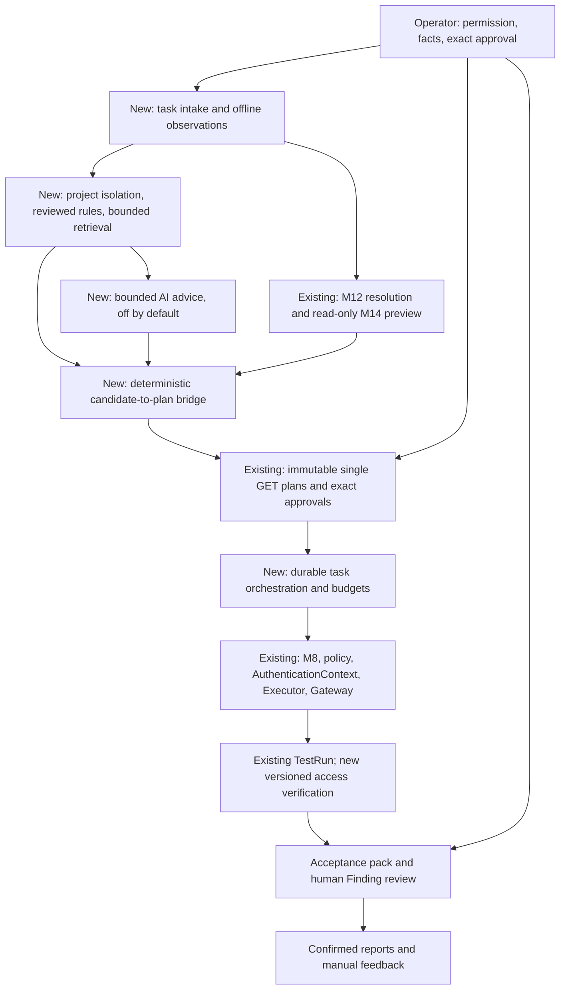

# Research Assistant v1 — A low-touch, low-token authorized research assistant

**PROPOSED / FOR REVIEW** · 2026-09-09 · [Issue #132](https://github.com/runyiy/ai-api-security-platform/issues/132)

This is a proposed plan, not implemented capability or execution permission. Every future milestone and work package is **NOT_STARTED / NOT_AUTHORIZED**. PASS below describes future acceptance conditions unless explicitly identified as historical or current documentation-task validation. Merging this document does not authorize RA-01 or start M15. The agreed M14-01 through M14-06 offline scope remains COMPLETE.

[Architecture decisions](architecture-decisions.md) and the [security model](security-model.md) remain authoritative. Conflicts block dependent work pending an explicit architecture decision; this plan cannot silently amend either document. New component, state, version, and work-package names below are **proposed**, not existing files, APIs, or database schemas. Maintain this as a single English plan, without a parallel translation.

## 1. Product contract

Within explicit testing authorization, scope, business facts, and cost budgets, automate repetitive research, rule selection, controlled validation, and evidence preparation. Start with one trusted operator, local-first deployment, and API object-level authorization research (BOLA/IDOR), reusing the existing FastAPI/PostgreSQL backend.

The operator supplies initial settings, permission to test, allowed researcher test identities, and necessary business information; gives required exact-plan approvals; decides exceptions that cannot safely be resolved automatically; validates vulnerabilities; and reviews final reports. Consolidate these responsibilities into understandable decision points. Initial configuration never means indefinite approval of unlimited actions.

| Contract item | Proposed v1 scope |
| --- | --- |
| Inputs | One project's program rules and sources, explicit Targets, one selected revision per execution, Scope, automation permission, duration/request/rate/concurrency/cost caps; one offline observation format; explicit identities, Resources, slot assignments, and access/business facts. |
| Research | Self-controlled synthetic local APIs first; an intentionally narrow request-shape contract; normal allowed/denied access, isolation defects, legitimate sharing, and uncertainty. Third-party testing only after RA-09's independent gates. |
| Outputs | Coverage and gaps, evidence-backed candidates, reviewable exact single-action plans, controlled validation records, acceptance packs, formal reports after human confirmation, and model/effort accounting. |
| Routine automation | Validate local imports, retrieve reviewed rules, deduplicate candidates, apply deterministic checks, organize approved exact plans, execute within budgets, and prepare attributable review materials. |
| Uncertainty | Missing facts become proposed `NEEDS_INPUT`; unreliable interpretation becomes `inconclusive`; scope or context changes pause work. Unsupported, unexecuted, and unknown cases are never reported as safe. |
| Success | Meet thresholds frozen before evaluation at comparable coverage; demonstrate the complete supported journey; measure operator effort and model cost. Engineering completion, researcher efficiency, and business benefit are separate verdicts. |

This is not an unrestricted public scanner, an agent that obtains or enlarges authorization, a mass-report submission bot, or a guarantee of bounty income. Explicitly deferred: generic all-vulnerability scanning, mutating tests, arbitrary payload libraries, mass public exploration, automated account creation or login bypass, unrestricted shell/browser agents, unreviewed report submission, training a model, large vector infrastructure, multitenant SaaS, and infrastructure refactors without demonstrated need.

## 2. Exact baseline and capability gaps

Repository: `runyiy/ai-api-security-platform`. Exact baseline and assigned branch starting point: `6ea9109f7cd53c63ac038bbfb346b17d04f6d903`. Assigned branch: `docs/research-assistant-plan`. Before editing, fetch confirmed both `origin/main` and the assigned remote branch at that SHA, with no uncommitted changes. Existing Alembic head: `b5d7f9a1c3e6`; this documentation task adds no migration.

[PR #131's final record](https://github.com/runyiy/ai-api-security-platform/pull/131) records the README task merged at this baseline. [PR #129](https://github.com/runyiy/ai-api-security-platform/pull/129) and [Issue #128's closeout](https://github.com/runyiy/ai-api-security-platform/issues/128#issuecomment-5594300820) establish M14's offline completion. Earlier pending/later wording is slice history, not work to reopen. PR #131 records reviewed-head run `34311414092`, exact-main push run `34311806915`, and 2010 passed / 56 warnings. These are historical records read for this plan, not independently re-audited CI logs or validation of this branch.

The following evidence links are exact-base permalinks with key line ranges. Code establishes behavior; the Issue and normative documents establish obligations.

| Existing capability | Real file/function evidence | Current limitation | Reuse | Necessary addition — proposed |
| --- | --- | --- | --- | --- |
| Backend API | [main.py][src-main]: `app`, `health_check()`, router registration | No complete research-task scheduler, console, or platform login/RBAC; health is not authorization readiness | FastAPI, Sessions, existing operations | One local CLI and durable task services, RA-06 |
| Advisory AI | [AI route][src-ai-route]: `ai_provider = MockAIProvider()`; [service][src-ai-service]: `AIAnalysisService.analyze_finding()`; [protocol][src-ai-provider]: `AIProvider.analyze()` | Requires an existing Finding/TestRun/TestCase; not upstream autonomous discovery; no live provider integration | Provider protocol, analysis persistence and transaction boundary | Separate proposal contract, one live provider, budgets and usage; RA-01/05 ADRs |
| Redaction | [redaction.py][src-redaction]: `redact_json_value()`, `sanitize_response_body()` | Sensitive-key matching, non-JSON replacement and truncation do not establish complete privacy protection; ordinary JSON fields may retain PII or business content | Sanitization helpers and secret/non-JSON regressions | Data classification, field allowlists, eligibility, lifecycle and provider egress controls |
| M14 preview | [composer][src-composer]: `preview_bola_binding_matrix()`; [selector][src-selector]: `select_bola_binding()`; [preview][src-preview]: `preview_bola_matrix()` | Read-only, transient, no cross-request cache; confirmed slots do not prove Resource-to-slot approval or membership; no executable request/plan | Explicit assignments, identities, time, path/query selection, independent facts and bounds | Separate consumer with confirmed, versioned context and a narrow plan bridge |
| Access truth | [resolver][src-resolver]: `resolve_resource_access()` | No inferred role policy or business membership; 256 eligible assertions allowed, 257 fails; conflicts have no winner | Aware evaluation time, asserted_at eligibility, half-open validity, supporting assertion IDs | Explicit business facts and reviewed candidates; NEEDS_INPUT when missing |
| TestCase planning | [planning][src-planning]: `create_test_case_execution_plan()`; [URL builder][src-builder]: `build_test_case_url()` | Legacy builder uses `detect_resource_binding()`, substitutes one path parameter, and rejects unresolved parameters; not an M14 general renderer | Deterministic URL/Scope checks and TestCase provenance | Restrict the bridge to supported shapes; no automatic query/nested/multi execution |
| Immutable plans and approval | [plan][src-plan]: `compute_plan_digest_v1()`, `create_execution_plan()`; [approval][src-approval]: `validate_persisted_plan_integrity()`, `record_plan_decision()` | Storage permits 1–100 actions, which does not mean multi-action execution works; approval binds an exact digest | Immutable revision, digest, approval and revocation | Task orchestration over separate single-action plans; consolidated review with exact per-plan decisions |
| Actual execution | [plan_execution.py][src-execute]: `PlanExecutionService.execute()`; [refresh/result path][src-execute-refresh] | Accepts exactly **ONE GET action**, with existing TestCase/Resource provenance; cannot accept an M14 candidate directly | Execution, policy refresh, audit, canonical TestRun | Bridge and task composition; no default Executor expansion or provenance bypass |
| Credentials | [auth/context.py][src-auth]: `build_authentication_context()`, `apply_authentication_context()` | anonymous/none and bearer; no generic Cookie, MFA, browser login or session acquisition. M14 separately recognizes exact `anonymous` | AuthenticationContext-only material and encrypted bearer CredentialBinding | Explicit identity choice, session health interpretation and manual renewal |
| M8 coordination | [progress][src-progress]: `ExecutionPlanProgressService.prepare_attempt()`, `mark_network_started()`; claim/progress/cancellation composition in [PlanExecutionService][src-execute] | Shared PostgreSQL coordination is not a research-task worker/scheduler; network_started/in-doubt cannot be blindly replayed | Claims, leases, fencing, rate reservations, cancellation, canonical results, permits | Durable bounded task state, budgets, recovery and exception aggregation |
| Findings and evidence | [finding analysis][src-finding]: `FindingAnalysisService.analyze_test_run()`; [analyzer][src-analyzer]: `analyze_bola_run()` | Legacy cross-owner intent and owner baseline; cannot represent all owner+denied/non_owner+allowed semantics | Exact baseline/probe, atomic evidence appends, immutable fingerprints, conflict handling | Separate versioned access verification and intent/evidence compatibility |
| Retention | [retention constant][src-retention]: `V1_FINDING_EVIDENCE_RETENTION_POLICY`; [TestRun][src-run]: `response_body`; [binding persistence][src-retention-persist]: `_persist_retention_binding()` | Policy binding does not delete source bodies; no TTL or cleanup API; old fingerprints bind exact persisted UTF-8 strings | Minimized evidence, five v1 constants and immutable history | Explicit source-body lifecycle ADR; never treat clearing old fields as an already compatible cleanup |
| Review and reports | [Finding review][src-review]: `review_finding()`; [report service][src-report]: `SecurityReportService.generate()` | Formal reports require confirmed status; templates remain cross-owner oriented; no external feedback/award/payment product ledger | Human review and versioned Markdown reports | Attributable report text and acceptance packs; separate external outcomes, awarded and paid |
| Network boundary | [HTTP executor][src-http]: `PolicyEnforcedHTTPExecutor.execute()`; [gateway][src-gateway]: `NetworkGateway.request()`, `_BoundNetworkBackend.connect_tcp()` | `external_public_authorized` is blocked before the gateway; existing DNS/IP/peer controls are not proof of complete public readiness | GET-only, refresh, rate limits, gateway, peer checks, bounds and kill switches | RA-08 audits all outbound paths, fills demonstrated gaps and separately reviews public release |

Read in full: README, all five existing docs, Issue #132 and PR #131's final record; PR #129 / Issue #128 closeout was also checked. The implementation paths above, relevant route/schema/model code, database configuration, CI, and representative tests were inspected. This is not a whole-repository audit: not every migration, route, or M8/M9/M10 internal path was read line by line. RA-01 must complete the dependency inventory at its own exact base; RA-08 must review all outbound paths afresh.

Representative inspected regressions include [M14 acceptance](../backend/tests/integration/test_m14_matrix_acceptance.py), including the real HTTP→DB→planner path and forbidden-side-effect guards; [single/multi-action and approval tests](../backend/tests/services/test_plan_execution.py); [AI redaction boundary](../backend/tests/ai/test_analysis_redaction_boundary.py); [M13 exact retention binding](../backend/tests/api/test_finding_evidence_retention.py); `test_local_bola_workflow_end_to_end()` in the [secure/vulnerable local lab](../backend/tests/integration/test_bola_lab.py); and canonical one-request/in-doubt cases in [M8 real-process tests](../backend/tests/integration/test_m8_multiprocess_readiness.py). Their assertions do not prove future product usefulness.

## 3. Operator journey and interruption policy

This is the proposed complete journey. RA-04 demonstrates a thin local path; RA-06/07 add the everyday interface and measured local release.

1. Create a research task with permission sources, program rules, explicit Target/revision/Scope, automation limits and budgets. Supply allowed test accounts and synthetic data; check participation eligibility. The system lists missing facts rather than applying for authorization or enrolling new Targets.
2. Submit one bounded local observation file. Review its sensitivity summary and permitted retained fields. Imported URLs remain untrusted data; import neither fetches/replays them nor claims a TestRun occurred.
3. Explicitly select identities and Resources, confirm Resource-to-slot assignments and necessary business relationships, and provision/renew bearer credentials through the existing boundary. Resolve assertions at an explicit time against current metadata; show conflicts, unknowns and unsupported shapes.
4. Apply reviewed rules and bounded retrieval. If separately enabled and necessary, obtain structured AI advice. A deterministic bridge creates a bounded set of exact single-GET plans showing URLs, identity references, revision, resources, pairings, request count and budget, without secrets.
5. Where approval is required, review each complete plan and digest in one consolidated view, then explicitly approve the selected finite set. Persist separate exact-plan decisions. Unseen, newly generated or materially changed actions never inherit approval. Execution itself needs no additional per-request clicks.
6. Execute approved actions with immediate checks and response/session interpretation; prepare evidence. Baseline and probe are separate single-action plans with their own provenance and required approvals. Any health request must also be an approved, budgeted exact GET; it cannot be hidden extra traffic.
7. Review an acceptance pack and uncertainty/coverage gaps. A person checks business truth, exact pairing and demonstrated impact, then decides Finding confirmation. Retesting creates a new plan with applicable approval. Formal reports follow human confirmation, source checking and a human submission decision.
8. Manually record external needs-info, duplicate, invalid or accepted outcomes and distinct awarded/paid amounts. Review quality, coverage, model/effort/infrastructure cost and the stop decision. A completed task need not find a vulnerability or earn money.

| Situation | Proposed automatic response | Human/recovery condition |
| --- | --- | --- |
| Confirmed facts, applicable rule, sufficient budget | Bounded offline work, execution within exact authorization/approval, evidence preparation, summarized progress | No routine per-request interruptions |
| Missing/conflicting access, ambiguous slot, missing login/MFA/business facts | NEEDS_INPUT; no guessing or dependent execution | Consolidated fact requests; attributable human input, re-resolution and replanning |
| Expired session, abnormal authentication rejection, 200 login page | Pause affected validation; retain inconclusive outcome | Manual renewal and fresh health verification; do not reuse an invalid baseline |
| Target/revision/Scope/network-mode/identity/resource/binding/count changes | Invalidate affected pending candidates while preserving history | Material changes need new exact plans and applicable approvals |
| Budget/usage uncertainty, rate/health limits, cancellation, kill switch, audit failure | Immediately stop starting actions; preserve completed and in-doubt outcomes; show critical failures immediately | No answer means remain paused; budget increases require approval, not automatic renewal/provider switching |
| Crash/recovery | Reuse canonical results; recover only work proven not to have crossed the network boundary under M8 semantics | Never blindly replay unknown/in-doubt outcomes; a new request requires a distinct reviewed plan |
| Unexpected third-party or sensitive data | Stop collection, egress and further requests; isolate only necessary records | Follow the approved lifecycle/incident decision; no expansion to gather more evidence |

## 4. Proposed architecture and data flow

Retain the monolithic backend and PostgreSQL. “New” nodes below are proposed responsibilities, not prescribed filenames. Execution continues through the existing boundary.



The AI receives typed data and returns advice. It has no executor, shell, arbitrary fetch, credential, approval, Finding-confirmation or policy-write tools. Proposals do not schedule themselves; deterministic checks and required exact-plan approvals intervene.

Separate generalized mechanisms, reviewed rules, project-private observations/evidence, counterexamples, and external feedback. Access truth and permission stay project-specific. Start with PostgreSQL structured/tag/keyword retrieval, without vectors or training. Imported content, HTML, responses, database text, downloaded materials and model outputs are untrusted data, not instructions or arbitrary executable scripts. A “reviewed executable rule” means a reviewed declarative rule selecting controlled operations shipped through code review, not executable code stored in a database.

Choose one initial operator surface: a **local CLI**, appropriate for one operator and reuse of existing APIs without adding a browser authentication surface. RA-04's first thin demonstration uses localhost API operations, including a bounded bridge entry point proposed in RA-04; RA-06's routine journey must require no raw SQL or operator-written Python. Do not introduce Redis, microservices or complex queues by default, expose an unauthenticated management surface publicly, or create multitenant RBAC. A Skill is not a required v1 work package; if separately included later, it is a thin guidance/read/proposal adapter with no execution or approval bypass.

## 5. Finite milestones and dependencies

Every milestone and work package is **NOT_STARTED / NOT_AUTHORIZED**. Each stage has 1–3 cohesive packages, not an Issue per field/table/helper. If evidence demands more packages, report size, risk, possible cuts and dependency consequences, then obtain scope approval before expansion. Do not append an indefinite milestone chain or create future GitHub Issues/milestones under this task.

| Stage | Observable delivery | Direct dependency / entry decision | Exit direction | Status |
| --- | --- | --- | --- | --- |
| RA-01 | Executable product/evaluation contract and ADR specification | Plan review, then separate first-task authorization | Frozen oracle, thresholds and required ADRs | NOT_STARTED / NOT_AUTHORIZED |
| RA-02 | Safe observation import and identity/resource/budget context | RA-01; data lifecycle decision | Safe inputs for retrieval/planning | NOT_STARTED / NOT_AUTHORIZED |
| RA-03 | Reviewed rules with versions and counterexamples | RA-02; knowledge eligibility/isolation review | Repeatable bounded retrieval | NOT_STARTED / NOT_AUTHORIZED |
| RA-04 | Thin local candidate→plan→validation→evidence demonstration | RA-03; bridge/intent/evidence ADR | Reliable narrow-shape verification | NOT_STARTED / NOT_AUTHORIZED |
| RA-05 | Budgeted genuine AI advice on demand | RA-04; AI proposal and provider egress ADRs | Fake regressions and separately approved live verification | NOT_STARTED / NOT_AUTHORIZED |
| RA-06 | CLI start/pause/cancel/recover of durable tasks | RA-05; orchestration/approval/recovery ADR | Routine use without SQL/Python | NOT_STARTED / NOT_AUTHORIZED |
| RA-07 | Acceptance packs, reports, feedback, measured local release | RA-06; frozen evaluation and expense approval | Local go/no-go | NOT_STARTED / NOT_AUTHORIZED |
| RA-08 | Public control gap review and separate self-owned exercise | RA-07 go; public ADR and dedicated scope | Distinct readiness/exercise decisions | NOT_STARTED / NOT_AUTHORIZED |
| RA-09 | One authorized small pilot and benefit review | RA-07, RA-08, fresh third-party permission | STOP / RETAIN_AS_ASSISTANT / explicit new proposal | NOT_STARTED / NOT_AUTHORIZED |

Dependency DAG: `RA-01 → RA-02 → RA-03 → RA-04 → RA-05 → RA-06 → RA-07 → RA-08 → RA-09`, plus the explicit `RA-07 → RA-09` benefit gate. Applicable ADRs and fresh task authorization are additional entry conditions. RA-04's demonstration does not depend on RA-05/06/07. RA-01 specifies future interfaces and oracles as design inputs; it does not claim reuse of unimplemented components, so there is no reverse dependency.

## 6. Milestone acceptance cards

All tests in these cards are future requirements. This Issue runs existing regression only. Every package below is **NOT_STARTED / NOT_AUTHORIZED**; an exit PASS never automatically authorizes the next stage.

### RA-01 — Product contract, baseline and executable evaluation/ADR specification

- **Operator outcome and entry:** After separate RA-01 authorization and an exact-base recheck, the operator can take a labeled synthetic case and identify its inputs, allowed behavior, expected output, human decisions and objective scoring. This must make later acceptance executable rather than repeat the macro plan.
- **Included / excluded:** Freeze one operator, local BOLA, supported shapes, interruption policy, fixture manifest and oracle specification. Exclude provider integration, import features, autonomous execution and public work.
- **Reuse / additions:** Reuse the baseline inventory, M14 acceptance, secure/vulnerable lab, and M8/AI/M13 regressions. Add a versioned evaluation manifest, independent label rationale, result schema, source/compatibility inventory and ADR decision materials.
- **Ordered packages:** (1) **RA-01/W1:** freeze product contract, real call graph and supported shapes, with source/limitation/output evidence for each claim. (2) **RA-01/W2:** specify synthetic development and isolated held-out sets, deterministic clocks, executable scoring rules, result schema and Section 7 thresholds; provide sample input/output and a minimal scoring demonstration. (3) **RA-01/W3:** review Section 8 ADR proposals; approve the data decisions needed by RA-02 and record checkpoints for the remaining decisions.
- **Positive / negative / boundary tests:** Score predetermined correct outputs; deliberately mislabel legitimate sharing as a vulnerability, unknown as safe, and omit a model call, requiring scoring failure. Check zero denominators, missing fields, holdout leakage, exact/over-budget values, and aware versus naive time. The oracle must detect wrong answers before evaluating the product; model self-grading is not the oracle.
- **Human work and PASS evidence:** Tech Lead approves the inventory and applicable ADRs; operator accepts usability, thresholds and budget. Require manifest version/hash, every scenario's label rationale, machine-readable result schema, sample expected output, reproducible scoring procedure, pre-evaluation threshold freeze, and approved/pending ADR register. A complete future product runner is not required here.
- **Failure / migration / ADR / privacy / expense:** Stop if outcomes cannot be objectively judged or a normative conflict remains. Preserve the pre-evaluation version; do not lower thresholds to fit results. No application migration, sensitive real data or paid model/cloud use. ADR approval is a design decision, not execution authorization.
- **Exit:** RA-02's contract, data decisions and acceptance method are usable; unapproved later ADRs block dependent code. Next stage: **RA-02 NOT_AUTHORIZED**.

### RA-02 — Task rules, bounded offline observations and usable test context

- **Operator outcome and entry:** RA-01 PASS, separate stage authorization and applicable source-data/lifecycle approval. The operator can enter one project's rules and hard budgets, import a local observation file and complete identity/resource facts.
- **Included / excluded:** Start with one versioned, bounded HAR-derived JSON observation format: permitted method, sanitized origin/path, explicit resource labels, timestamps and selected response facts. RA-01 freezes fields and byte/item/depth limits; accept UTF-8 only and reject extras/external references. No full HAR compatibility promise, URL/HTML-resource fetching, replay, scripts, automatic Target registration or authentication acquisition.
- **Reuse / additions:** Reuse Target/Scope/revision, TestIdentity, Resource, M11 binding and M12 assertion APIs, AuthenticationContext and encrypted bearer storage. Add task-intake metadata, independent observation provenance, budget configuration and fact gaps. Imported observations are never executor-produced TestRuns or automatically verified assertions.
- **Ordered packages:** (1) **RA-02/W1:** program/permission/budget intake and source validation; missing permission blocks execution preparation. (2) **RA-02/W2:** bounded offline parsing, project isolation and minimized persistence with no network side effects. (3) **RA-02/W3:** explicit identity/Resource/slot proposals, business-fact entry and manual credential updates; missing facts become NEEDS_INPUT. Supply session-check facts for RA-04 without sending Target requests in this stage.
- **Positive / negative / boundary tests:** A synthetic valid file preserves provenance/order. Cross-project IDs, malicious URL/HTML instructions, duplicate/deep JSON, secret fields and unreviewed Targets fail or quarantine with zero fetch/execution. Test exact/over byte/item limits, empty input, conflicting labels and unknown login/MFA/permission facts. Ordinary field names do not make PII eligible for persistence.
- **Human work and PASS evidence:** Human supplies permission, allowed accounts/synthetic data, business facts and retained-field eligibility; credentials use the existing boundary. Require a complete import example, schema/limit version, zero-network/zero-TestRun assertions, project-isolation and secret/PII canary tests, missing-input/correction history and approved data-handling record.
- **Failure / migration / ADR / privacy / expense:** Pause on uncertain data eligibility, provenance or binding. Bounded sanitized errors must not echo or log raw imports. Additive observation/intake storage may need migrations, tested on isolated databases with legacy compatibility. Implement applicable lifecycle controls before sensitive persistence; do not modify M13 v1 constants or historical source bodies. No paid provider or public resources.
- **Exit:** Safe observations and explicit facts can feed retrieval; required sensitive-data controls cannot remain TODOs. Next stage: **RA-03 NOT_AUTHORIZED**.

### RA-03 — Versioned knowledge, reviewed rules and bounded retrieval

- **Operator outcome and entry:** RA-02 PASS and separate authorization. The operator can inspect a rule's source, version, applicability, counterexamples, reviewer and reasons for abstention.
- **Included / excluded:** Separate general mechanisms, reviewed rules, private evidence, negative examples and external triage outcomes. Use PostgreSQL structured/tag/keyword retrieval. Exclude embeddings/vector platforms/fine-tuning initially; a growing database is not model training.
- **Reuse / additions:** Reuse PostgreSQL and established provenance/review patterns; knowledge review cannot replace M12 access-truth review. Add versioned rules, license/reuse/privacy eligibility, review status, applicability and bounded retrieval. Private project evidence stays local to that project and outside model input; only independently reviewed generalized material may become reusable knowledge.
- **Ordered packages:** (1) **RA-03/W1:** category/version and reviewed publication contracts; candidates never publish automatically. (2) **RA-03/W2:** filter by project, eligibility and review before bounded keyword/tag ranking; return exact versions and citations. (3) **RA-03/W3:** positive/counterexample rule validation and feedback-promotion review; keep held-out cases out of retrieval/training.
- **Positive / negative / boundary tests:** Fixed context retrieves expected eligible rules. Cross-project canaries, expired/unreviewed/unlicensed entries, injected instructions and stored scripts cannot reach execution or model input. AI hypotheses cannot become verified truth. Check no matches, duplicate versions, exact/over top-k and highly ranked but inapplicable rules; ownership assumptions cannot override legitimate-sharing counterexamples.
- **Human work and PASS evidence:** Review rules, counterexamples, provenance and reuse eligibility. Require rule-card examples, positive/negative results, publication history, bounded retrieval traces, cross-project/holdout leakage failures and repeatable query results. One project's permission or access truth must never authorize another.
- **Failure / migration / ADR / privacy / expense:** Disable contaminated versions, preserve references/history and re-evaluate pending candidates. Do not overwrite old evidence. Rule/knowledge tables may require additive migrations; approve classification/reuse decisions first. No arbitrary downloaded/database script execution or model expense.
- **Exit:** Narrow local cases receive reviewed rules, counterexamples and explicit gaps; no-match cases abstain. Next stage: **RA-04 NOT_AUTHORIZED**.

### RA-04 — Separate local plan bridge and reliable access verification

- **Operator outcome and entry:** RA-03 PASS, separate authorization, and approved immutable-intent/evidence/bridge ADR. Using a synthetic local target, the operator can turn an eligible candidate into reviewed exact plans, execute a baseline/probe pair and inspect attributable validation evidence.
- **Included / excluded:** A separate consumer of M14 output; no mutation, persistence or cache added to the preview itself. Confirm Resource-to-slot mapping, required business relationships and current identity/session facts; preserve immutable selected context and revalidate before execution. Only the supported shape table below is executable through this bridge. No generic renderer, multi-action Executor expansion, browser sessions, arbitrary headers/body, public testing or automatic Finding confirmation.
- **Reuse / additions:** Reuse M12/M14, existing URL builder where compatible, exact-plan creation/approval, M8 and the execution/network/credential boundary. Add a versioned confirmed intent/context linked to real TestCase/Resource provenance, a deterministic bridge, explicit pair identity and a separate assertion-aware verifier. Preserve legacy TestCase uniqueness/readers, owner generator/analyzer, exact-pair history and old evidence versions; do not relabel new semantics as legacy cross-owner cases. Additive versioned companion records are a proposed option to settle in the ADR, not existing schema.
- **Ordered packages:** (1) **RA-04/W1:** reviewed candidate-to-intent/plan bridge with a bounded local API entry point, explicit slot mapping and stale-context rejection; each resulting plan has one GET and one immutable revision. (2) **RA-04/W2:** session/semantic response validation, exact baseline/probe pairing and versioned evidence/uncertainty, including explicit owner-denied and non_owner-allowed facts. (3) **RA-04/W3:** first thin local end-to-end demonstration and compatibility/safety acceptance, composing existing local operations with that new bridge entry point; no dependency on AI or the later CLI.
- **Positive / negative / boundary tests:** Normal allowed/denied access, a real synthetic isolation flaw, legitimate sharing, owner+denied and non_owner+allowed. An authorized baseline may be a non-owner explicitly allowed subject; never invent owner access. Missing/conflicting facts, expired sessions, 200 login pages, truncation/non-JSON responses and insufficient object proof must abstain. Missing/ambiguous binding, unconfirmed membership, changed metadata, mismatched pair/revision, stale approval, cancellation and unsupported shapes must cause no unauthorized requests. Status, digest equality or byte length alone cannot decide access.
- **Human work and PASS evidence:** Human confirms mappings/business facts and required exact plans, then reviews the suspected vulnerability. Require a reproducible local transcript from intake through candidate, plan digests, approvals, baseline/probe TestRun IDs, selected revision/assertion/context versions, verifier output and minimized evidence; server-side request counters for denial cases; preserved legacy reads/reanalysis/fingerprints and M14 zero-side-effect/no-cache regressions. Include secure, vulnerable and sharing demonstrations, not only unit tests.
- **Failure / migration / ADR / privacy / expense:** Changed context pauses pending work and requires new plans/approvals; mismatched or missing baseline is inconclusive. Never repair evidence by rewriting old pairs, fingerprints or review. Additive intent/evidence migrations require old-reader and rollback tests; approved lifecycle applies before new sensitive source persistence. Local synthetic data only, zero real provider expense.
- **Exit:** Thin local journey works for the declared shapes, and unsupported coverage stays visible. Next stage: **RA-05 NOT_AUTHORIZED**.

| Request shape | Current M14 planning | Proposed initial RA bridge |
| --- | --- | --- |
| GET with one unambiguous resource path parameter compatible with the existing builder; JSON object evidence | Reviewed path slot and independent access facts | Supported after explicit Resource-to-slot confirmation; baseline/probe are separate exact single-action plans |
| Anonymous or bearer actor on that shape | Explicit identities; exact anonymous metadata has distinct semantics | Supported with explicit expected-access facts and applicable credentials; no automatic identity selection |
| Query resource binding | Reviewed query-slot preview | Preview/coverage record only; execution excluded from initial v1 bridge |
| Nested parent/child or multiple path/query resource slots | Independent slot facts; membership unproven | Preview/coverage record only; no inferred parent-child relation or aggregate executable verdict |
| Body binding, mutating method, arbitrary headers/cookies/browser login | Body selection unsupported; no execution authority | Unsupported; never sent automatically |

The first thin demonstration uses synthetic accounts A/B and one object: secure denial, deliberately vulnerable cross-subject access, and legitimate sharing with explicit facts. Use separately budgeted health/baseline/probe plans where needed. When no valid allowed baseline exists, such as an owner-denied case without another confirmed allowed subject, retain the explicit denial fact and return inconclusive rather than fabricating a baseline. Report export can use the existing confirmed legacy path only where its semantics truly apply; generalized report support is RA-07 work.

### RA-05 — Genuine AI assistance with enforceable small budgets

- **Operator outcome and entry:** RA-04 PASS, separate implementation authorization, and approved AI proposal/provider-egress ADRs. The operator can explicitly enable one provider for an eligible, bounded advisory task and inspect cited suggestions, abstention and actual usage. Live verification additionally requires credentials, data eligibility and an approved cost cap.
- **Included / excluded:** One real provider adapter and one model-selection policy, chosen from current official documentation during that task; no silent provider shopping or fallback. Reviewed rules first, bounded retrieval second, model escalation only for unresolved interpretation or proposals. Typed outputs include evidence references, uncertainty and abstention. AI cannot execute, approve, confirm Findings, access credentials, fetch arbitrary URLs, use shell tools or change policy.
- **Reuse / additions:** Reuse `AIProvider`, existing sanitized analysis/results and fake-provider patterns where applicable. Add a separately reviewed proposal interface, provider transport/data/secret boundary, bounded context builder, budget reservations/reconciliation, usage records and immutable analysis cache. Existing Finding analysis is not silently redefined as the upstream discovery service.
- **Ordered packages:** (1) **RA-05/W1:** provider adapter, strict input/output contracts and independent egress enforcement; live calls off by default, CI fake-only. (2) **RA-05/W2:** deterministic escalation, bounded retrieval/context, input/output/round/time/cost caps and actual-usage reconciliation, including cancellation/failure. (3) **RA-05/W3:** cache isolation and adversarial fake acceptance, then a separately approved minimal live smoke with eligible synthetic data; no full paid benchmark until its own approval.
- **Positive / negative / boundary tests:** A fake returns valid cited advice; unsupported claims and malformed output fail closed or abstain. Inject instructions through observations, retrieved text and tool results; reject attempts to execute, obtain secrets, approve plans or publish rules. Test disabled calls, wrong provider destination, redirect, secret/PII canaries, cross-project cache keys, exact/over token/time/money limits, provider timeout, missing usage, cancellation and partial results. No automatic retry after ambiguous billing; uncertain usage keeps the reservation and pauses further calls.
- **Human work and PASS evidence:** Human approves provider/model/data/cost policy and reviews material proposals. Require fake negative-test traces proving zero forbidden capability, actual sanitized payload inventory, budget reservation/reconciliation examples, cache isolation/version tests, model/policy identifiers and official-source access dates. A genuine-provider claim also requires the separately approved live request's success/abstention and actual usage/cost record; fake success alone cannot close that claim.
- **Failure / migration / ADR / privacy / expense:** Disable provider calls on data, transport, schema or budget uncertainty; retain rule-only operation where independently authorized. Analysis/usage records may need additive migrations with legacy FindingAIAnalysis compatibility. Provider secrets are separate from Target credentials; Target permission does not authorize provider egress. Private project evidence never enters cross-project knowledge or model input. No live call under this documentation Issue; lack of future expense approval keeps live verification pending.
- **Exit:** Advisory behavior is constrained and usage accounted for; separate live evidence is required for genuine-provider acceptance. Next stage: **RA-06 NOT_AUTHORIZED**.

Only immutable analysis may be cached, keyed by project/privacy class, eligible input digest, source/context/rule/prompt/schema/provider/model versions and applicable expiry. Never cache authorization, approval, execution permission or mutable access truth. Changed context forces a fresh check; analysis caching does not change M14's cross-request behavior. Provider-side caching is a separate egress/retention consideration, not a permission cache or automatic data eligibility.

### RA-06 — Durable low-touch workflow and one minimal operator interface

- **Operator outcome and entry:** RA-05 PASS, separate authorization and approved task/approval/recovery ADR. The operator uses a local CLI to create, inspect, approve, start, pause, cancel and safely resume a bounded research task without routine SQL/Python coding.
- **Included / excluded:** Persistent task state and budgets, deterministic composition of accepted capabilities and consolidated approvals/exceptions. Proposed states: `DRAFT`, `NEEDS_INPUT`, `AWAITING_APPROVAL`, `RUNNING`, `PAUSED`, `READY_FOR_REVIEW`, `COMPLETED`, `CANCELLED`, `FAILED`; final names require design review. Exclude a public console, multitenant RBAC, automatic account/session acquisition, Redis/microservices by default and general-purpose autonomous agents.
- **Reuse / additions:** Reuse M8 claims/leases/fencing, canonical results, cancellation, rate reservations and shared network controls; reuse RA-02/03/04/05 artifacts after acceptance. Add task state, per-task reservations, plan/result references, bounded worker lifecycle and CLI commands. Task ownership cannot replace exact-plan ownership or execution-time checks.
- **Ordered packages:** (1) **RA-06/W1:** bounded task transitions and atomic budget/progress persistence, with exact plan references. (2) **RA-06/W2:** safe recovery/cancellation and exception consolidation; in-doubt is visible and never blindly replayed. (3) **RA-06/W3:** local CLI intake/status/review/start/stop/resume journey, explicit finite plan-set review and usable consolidated missing-input prompts.
- **Positive / negative / boundary tests:** A normal approved task runs to READY_FOR_REVIEW without per-request clicks. Concurrent workers cannot duplicate the same exact request or overspend reservations. Test crashes before/after network markers, canonical result retrieval, lost fencing, coordinator failure, cancellation races, exhausted budget and absent operator answers. New/materially changed actions need new approval. Critical stop failures must stop immediately, not wait for a batch notification.
- **Human work and PASS evidence:** Operator performs setup, exact-plan review where required, grouped exception decisions and final review. Require an end-to-end CLI transcript from a clean synthetic setup, command help/errors, durable state/plan/budget trace, actual local server request counts across crash/concurrency tests, an in-doubt recovery demonstration with zero blind replay, and an intervention log including all clicks/time. Normal runs need no additional approval prompt after the exact finite set is approved.
- **Failure / migration / ADR / privacy / expense:** Without input stay paused; cancellation is terminal for affected plans, not silently undone by resume. Existing results remain accessible without a new request. Task/budget tables may require migrations and restart/rollback validation; preserve M8 semantics and legacy topology restrictions. CLI credentials must not appear in command history, logs or exports. AI remains opt-in with the approved cap; no new infrastructure expense by default.
- **Exit:** The supported local workflow is durable and operable without manual database/programming work. Next stage: **RA-07 NOT_AUTHORIZED**.

### RA-07 — Acceptance packs, reporting, feedback and measured local release

- **Operator outcome and entry:** RA-06 PASS, separate authorization, frozen labeled/held-out evaluation and any necessary paid-run approval. The operator completes the full local journey, reviews an acceptance pack, confirms a Finding when justified, exports a factual report and records feedback.
- **Included / excluded:** Reproducible exact evidence packs with uncertainties/coverage gaps; human confirmation; attributable report text in the selected report language, including Chinese/English support as a future product requirement; manual Butian/HackerOne export/submission targets. Exclude automatic submissions/disclosure, invented reproduction/impact and presumed platform submission APIs. This plan itself remains English only.
- **Reuse / additions:** Reuse Finding review, M13 evidence guarantees, versioned Markdown reports and the accepted task/verifier artifacts. Add general intent-aware report assembly, review notes for unconfirmed cases, export checks, external feedback and distinct award/payment accounting. Legacy cross-owner templates remain unchanged for historical reports.
- **Ordered packages:** (1) **RA-07/W1:** acceptance pack and exact source citations; formal report generation only from confirmed Findings, with factual language checks. (2) **RA-07/W2:** manual export and separate external outcome/award/payment records; only reviewed generalized feedback may enter reusable knowledge. (3) **RA-07/W3:** complete no-SQL/no-coding local demonstration and fixed comparative quality/cost/intervention evaluation, followed by a written go/no-go.
- **Positive / negative / boundary tests:** Secure/vulnerable/shared/uncertain cases yield the right pack and coverage accounting; confirmed cases generate attributable text. Potential/reviewing/false-positive Findings cannot generate formal reports. Missing steps, mismatched pair/version, secret-containing exports and fabricated impact must fail. Test duplicate/needs-info/accepted without payment, award without payment, zero findings and partial pilot observations. Preserve old evidence/report reads and do not promote private feedback to model context.
- **Human work and PASS evidence:** Human checks vulnerability truth, severity/impact, report facts and submission decision; records external responses. Require a complete local CLI demonstration, evidence-to-sentence traceability, confirmation/report-gate failures, feedback examples, Section 7's raw result ledger and denominators for all three modes, cold/warm results, all human/tool-development effort and costs, and separate engineering/efficiency verdicts. A green pytest run alone is insufficient.
- **Failure / migration / ADR / privacy / expense:** Poor quality, hidden coverage gaps or no demonstrated benefit triggers no-go/stop or an explicitly approved smaller scope; no automatic extra milestones. Feedback/report metadata may need additive migration and version compatibility review. Minimize exports, protect confidential responses and require data eligibility. Paid evaluation is a separately approved run, not CI; without it no measured live-model savings claim is made.
- **Exit:** Local usefulness and safety are demonstrated at declared coverage with a documented go/no-go. Next stage: **RA-08 NOT_AUTHORIZED** even after go.

### RA-08 — Public SRC Readiness and a separate self-owned-public exercise

- **Operator outcome and entry:** RA-07 local go, separate stage authorization, approved public-release ADR and dedicated implementation/validation scope. The operator can inspect current control gaps and, only after a separate exercise approval, observe a bounded self-owned-public validation.
- **Included / excluded:** Begin with an evidence audit of every outbound path and existing controls; implement only demonstrated gaps. Cover default-deny release state, exact Target/revision/Scope, DNS/IP/actual-peer/TOCTOU, allowed methods, redirects, credentials, quotas, kill switches, audit and source-data lifecycle. Preserve GET-only. Exclude third-party research and any automatic removal of the runtime block because this plan or another milestone passed.
- **Reuse / additions:** Reuse existing policy, NetworkGateway, destination classification/peer validation, M8 topology controls, approvals and evidence. Add only missing public release enforcement, control coverage and dedicated readiness proof identified by the audit. Provider egress and metadata retrieval remain separately bounded paths; neither can serve as a public Target bypass.
- **Ordered packages:** (1) **RA-08/W1:** all-outbound control/evidence gap inventory with reuse verdicts, threat cases and exact proposed release scope. (2) **RA-08/W2:** separately approved control additions and negative tests, default-off narrowly enabled release design and review. (3) **RA-08/W3:** separately authorized self-owned-public exercise with explicit host ownership, request/time/cost caps and rollback/stop proof; record it independently from control readiness.
- **Positive / negative / boundary tests:** Controlled fixtures first; a narrowly permitted public GET only in the approved exercise. Deny public mode without release approval; deny loopback/private/link-local/metadata/reserved destinations, mixed public/prohibited IPv4/IPv6 answers or rebinding/peer mismatch, wrong origin/path/port/revision, unreviewed hosts, redirects, mutating requests, missing credentials, stale approval, exhausted quotas and failed kill/audit controls. Exercise both topology and all applicable outbound paths; no tests may intentionally contact real prohibited infrastructure.
- **Human work and PASS evidence:** Tech Lead approves exact control implementation/release; operator separately approves ownership, exercise actions and expense. Require the control inventory, negative-test network counters, exact reviewed code/CI evidence, approved exercise contract, actual peer/request/audit/stop records, minimized source-data handling and a restore-to-blocked demonstration. Control readiness and successful owned-server exercise each receive their own decision; third-party permission remains separate.
- **Failure / migration / ADR / privacy / expense:** Any failed mandatory control denies execution; disable public mode and preserve minimized audit on exercise failure. Migrations/configuration changes are only within later approved scope, with rollback and compatibility checks. Public response lifecycle must be implemented, not promised. Real public requests, deployment and paid resources need separate authorization; none occurs under Issue #132.
- **Exit:** Both applicable control-readiness and self-owned exercise gates have evidence; neither grants third-party permission. Next stage: **RA-09 NOT_AUTHORIZED**.

### RA-09 — One explicitly authorized small pilot and benefit review

- **Operator outcome and entry:** RA-07 go, RA-08 PASS, all independent public gates, separate pilot authorization and fresh approved program revision/Target list/automation policy. The operator conducts one bounded pilot and decides whether to stop or retain the assistant.
- **Included / excluded:** One explicitly permitted program, allowed operator-controlled researcher accounts and synthetic data, fixed duration/request/cost caps and objective stop conditions. Check current participation/payment eligibility without publishing personal information. Exclude marketplace scraping followed by enrollment, mass probing, destructive testing, unrelated third-party data collection, automatic submissions or disclosure.
- **Reuse / additions:** Reuse accepted task, plan, public boundary, evidence, report and feedback capabilities. Add only the pilot contract, outcome/effort/cost ledger and final review artifact; do not hide a new feature project inside pilot execution.
- **Ordered packages:** (1) **RA-09/W1:** fresh permission, program/identity/data eligibility, exact scope and automation constraints, numeric caps and stops, all approved before requests. (2) **RA-09/W2:** execute only that bounded pilot; maintain human vulnerability validation, report review/submission decisions and manual triage responses. (3) **RA-09/W3:** reconcile coverage, inconclusives, invalids/duplicates, all expenses/effort, awarded versus paid and the final STOP/RETAIN_AS_ASSISTANT/new-proposal decision.
- **Positive / negative / boundary tests:** Before live use, simulate permitted and revoked/excluded program revisions, account restrictions, zero remaining budget, cancellation and health failure. During the pilot, verify actual requests remain inside the approved contract; exercise stop behavior safely without probing prohibited destinations. A zero-finding result and an accepted-but-unpaid result must remain valid ledger states with no fabricated revenue.
- **Human work and PASS evidence:** Operator checks permission/eligibility, supplies permitted accounts/data, approves exact plans, validates findings, reviews reports and decides submission; handles triage. Require fresh permission references and timestamps, exact revision/Targets/digests, actual request/time/cost totals, exceptions/stop records, human validation/report decisions, external outcomes, separate awarded/paid records and explicit final verdicts for procedure, efficiency and business benefit.
- **Failure / migration / ADR / privacy / expense:** Stop at permission expiry/revocation, scope ambiguity, request/time/cost cap, unhealthy target, sensitive-data encounter, kill/cancel or failed safety control. No automatic cap extension, target substitution or new capability. No migration expected; a needed code/schema change requires a separate proposal. Protect personal/payment details and confidential evidence; all live expenses require advance approval.
- **Exit:** A no-finding pilot may pass procedural acceptance but cannot establish an income goal. End with **STOP**, **RETAIN_AS_ASSISTANT** for future separately authorized tasks, or an **explicit new proposal**. There is no automatic next stage and no continuation until a bounty arrives.

## 7. Quality, token cost and human-effort evaluation

These are **proposed requirements, not achieved measurements**. RA-01 must approve and freeze the manifest, thresholds, accounting rules and experiment protocol before evaluation; changes require a new version and disclosed re-evaluation. No engineering criterion requires a paid vulnerability by a deadline.

### Fixed cases and independent labels

Propose a held-out synthetic corpus of at least 96 cases: 32 known isolation defects, 32 known legitimate/secure outcomes and 32 cases requiring uncertainty or safe refusal. Use a separate development corpus, different object identifiers and fixture variants, with no held-out case, answer, response or near-duplicate used in knowledge retrieval, training, prompt examples or rule authoring. During the frozen evaluation, the current case's eligible input is supplied to the evaluated mode; expected labels and other cases' answers remain evaluator-only. Labels come from fixture behavior plus independently reviewed business-policy truth, not the model or system-under-test output. Keep the held-out oracle in the evaluator, unavailable to product retrieval.

RA-01 must specify exact allocation, stable IDs/hash, fixture version, deterministic evaluation times and scenario tags. Tags can overlap; the three primary outcome classes must have unambiguous denominators. Include all of:

| Required scenario | Expected future acceptance behavior |
| --- | --- |
| Normal allowed and properly denied access | Correct access observation with valid session and object proof; no false vulnerability |
| Real synthetic isolation flaw | Potential finding with exact pair and independent expected-denial fact; human confirmation still required |
| Legitimate shared access; non_owner+allowed | Preserve explicit allowance; do not treat another subject's access as a defect solely because of ownership |
| owner+denied | Preserve denial independently of relationship; do not invent an owner-success baseline |
| Missing/conflicting facts | NEEDS_INPUT/inconclusive with exact provenance; no guessed winner or dependent request |
| Expired session and 200 login page | No false access verdict; pause and request renewal/facts |
| Metadata/approval/revision changes | Stale pending work blocked; new context and applicable exact approval required |
| Over-budget, cancellation and recovery | Stop additional work; account for consumed/reserved usage; no blind replay of ambiguous outcomes |
| Unsupported query/nested/multi/body shapes | Visible unsupported coverage with zero bridge execution; do not silently drop them |
| Secret/PII/instruction injection and project isolation | No unauthorized persistence/egress, instruction execution or cross-project knowledge leakage |

### Comparable modes and denominators

Compare **A: rule-only**, **B: controlled full-context AI baseline**, and **C: reviewed rules + bounded retrieval + selective AI**. Use the same scenario IDs, permitted evidence, supported scope, source facts and objective labels. “Full context” means all eligible bounded synthetic context for that case, not raw secrets, private project evidence or unlimited input. If context cannot fit, record the limitation; do not silently truncate away necessary evidence. For B/C, freeze provider/model/settings/prompt versions and separate cold and warm cache runs. Use a prespecified repeated-run schedule (proposed: three runs per eligible case/mode), not retries until green; aggregate all attempts. A is deterministic but still includes its complete effort and supported coverage.

Report TP, FP, TN, FN, predicted-positive count, labeled-positive count, executed/evaluated count, total selected count, unsupported count and inconclusive/refusal count by mode and scenario. Precision = `TP / (TP + FP)`; effective recall = `TP / all selected labeled positives`, including missed/abstained positives in that fixed denominator. Also show conventional FN and inconclusive-positive counts separately so abstention is not hidden. Zero denominators are N/A, never perfect scores. Report supported-case results and the full selected corpus coverage separately; unsupported cases do not disappear from the ledger.

### Proposed thresholds to freeze in RA-01

| Gate | Proposed requirement before claiming PASS |
| --- | --- |
| Safety and mandatory scenarios | Zero unauthorized requests, secret/PII leaks, authority bypasses, holdout/project leakage or blind in-doubt replay. Every mandatory known-positive and known-negative sentinel must meet its oracle; any failure blocks release regardless of aggregate score. |
| Held-out quality and total coverage | Precision on supported cases at least 0.95 and effective recall over all selected labeled positives at least 0.90 for the adopted mode, with actual denominators and uncertainty intervals. All 96 selected cases retain an outcome; no suppression of unsupported/inconclusive cases. Label counts and sentinel allocation freeze before running. |
| Comparison integrity | Same supported shape set and full selected-case coverage for A/B/C; disclose refusals and incomplete runs. C cannot claim savings by reducing scope or missing more required positives; quality must meet the absolute gate and not regress against the comparable baseline being used for the claim. |
| Model usage | A has zero model calls. Proposed C case cap: at most 2 calls, at most 4,096 input tokens and 1,024 total generated tokens per call, including reasoning where applicable, and 60 seconds total model wall time per case. A stricter provider limit wins; a model whose total usage cannot be bounded is ineligible. B has its separately frozen bounded context/cost allowance. |
| Task bounds | Proposed local demonstration cap: 30 minutes, 100 total Target GET requests including health checks, concurrency 1, and rate no higher than the exact revision/platform caps. Hard aggregate model-token and monetary caps must also be numeric in each future approved run contract. Documentation/CI live-provider monetary cap is 0. |
| Token/cost benefit | To claim model savings, C must use strictly fewer total measured tokens and lower actual model cost than B on matched coverage, with cold/warm results separated. Do not preclaim a percentage. If C adds no useful benefit over A, retain rule-only operation rather than justify AI by token discounts. |
| Operator effort | Complete local demonstration without raw SQL/manual coding; after finite required approvals, zero extra routine per-request prompts. To claim efficiency, total operator minutes per matched completed task must improve against the declared comparable baseline, including setup, approvals, exceptions, verification and reporting. Report engineering/tool-development time separately and in total project effort. |
| Local release | RA-07 requires a usable full demonstration, all mandatory safety/quality evidence and a signed go/no-go. Aggregate pytest success cannot replace this gate. No-go stops public progression; narrower claims need an explicit scope decision. |

The proposed numeric limits are acceptance targets subject to pre-evaluation review, not statements of current performance. RA-01 must settle feasibility and denominators before implementation depends on them. RA-05 freezes the selected model and enforceable usage interpretation; RA-07 freezes the live experiment's monetary ceiling using current official prices and separate operator expense approval. No approval means no paid run, not an assumed zero-cost result.

### Accounting and learning

Reserve worst-case bounded token/cost allowance before each model call; reconcile actual usage after completion. Record estimated and actual cost, unknown/unreconciled reservations, model calls, latency, input/output, cached-input and cache-write categories when exposed, reasoning usage, and embeddings (zero initially). Input/output detail fields may be subsets: never add cached tokens to an input total that already contains them or reasoning tokens to an output total that already includes them. Store the provider accounting/version mapping; keep token volume distinct from discounted billable cost. If usage is missing, keep the conservative reservation and stop when another call cannot be proven within budget.

Prompt caching may reuse eligible prefixes and change billing; cached content still counts as context/token usage. Applicable minimums, cache writes, retention and rates depend on the selected model and must be checked at implementation time. The official guide describes separate cached/write usage fields; it does not establish a savings ratio for this project. [OpenAI prompt caching, accessed 2026-09-09](https://developers.openai.com/api/docs/guides/prompt-caching).

Record all human time: setup, permission interpretation, identity/business-fact entry, exact approvals, exception decisions, credential renewal, vulnerability validation, report editing, submission/triage, and tool development/debugging. Record unattended elapsed time separately. For benefit accounting retain infrastructure/model expenses, invalids/duplicates, inconclusives, internal Finding verdict, vendor outcome, awarded amount and paid amount/currency/date. Do not treat vendor acceptance as an award or an award as payment; no speculative income or conversion rate. Learning means reviewed improvements to rules/counterexamples after isolation checks, not automatic training or promotion of model assertions.

## 8. Security, compatibility, data handling and ADR checkpoints

### Invariants and failure tests

These preserve the existing normative requirements. Tests listed here are future acceptance requirements to be linked to existing tests where available; missing controls are gaps, not implied implementations.

| Invariant | Required negative proof / responsible stages |
| --- | --- |
| Default Deny; Target != authorization; one immutable revision per execution; no grant union | Missing/expired/revoked revision, mismatched Target and attempted combined grants cause zero execution. RA-04/06, re-audited RA-08. |
| Scope/platform safety only narrow; mandatory allowlist, exact origin and safe path | Out-of-allowlist host, cross-origin URL, unsafe/ambiguous path and Scope changes during waits fail before requests. Human approval cannot override them. RA-04/08. |
| GET-only; redirects disabled; bounded time/bytes/rate/concurrency | POST/other methods, redirect responses, oversize/slow responses, exceeded quotas and failed network controls deny/stop within bounds. No hidden health/retrieval requests outside budgets. RA-04/06/08. |
| AuthenticationContext-only credentials | Direct Authorization injection, wrong/inactive binding, expired/unknown session or credential leakage must fail; importer/generator/AI cannot supply headers. RA-02/04/05. |
| AI has no execution, approval, confirmation or policy authority | Prompt injection and malicious typed output cannot invoke tools, alter policy, auto-publish rules, confirm Findings or schedule new actions. RA-03/05/06/07. |
| Exact approvals are bounded and current | Material Target/URL/method/network-mode/identity/binding/revision/resource/request-count changes require new plans and applicable approval; revoked approval during wait blocks. Initial settings never approve future actions. RA-04/06. |
| Wildcard, DNS classification and enrollment are not connection permission | Newly observed/matched host cannot auto-enroll or execute; every executable host needs its explicit reviewed Target and selected authorization. RA-02/08/09. |
| M12 time and truth semantics | Explicit aware evaluation time, asserted_at eligibility and half-open validity; 256/257 bound; verified conflict stays conflict, with no provenance/latest/confidence winner. Preserve append-only candidate review and exact supporting IDs. RA-01/03/04. |
| M13 history and evidence | Wrong exact baseline/probe, changed stored bodies or incompatible evidence/retention values fail without rewriting prior evidence/review. Preserve fingerprints, append-once behavior and similarity-only metadata. RA-04/07. |
| M14 remains read-only/transient | Success/failure produces no writes, credentials, Target traffic or executable plans; no cross-request cache. Preserve clean-session semantics, explicit assignments/identities, request-wide failures and current metadata boundaries. RA-04 integration and all regression gates. |
| Untrusted data and privacy isolation | Import/retrieval/response/model-output canaries cannot become instructions, arbitrary scripts, verified truth, leaked secrets or cross-project evidence. Reject unsafe retention/egress before persistence/transmission. RA-02/03/05/07. |
| Public runtime stays blocked pending independent release | Merging the plan, M14 completion, AI opt-in or local PASS cannot enable public mode. Check every outbound path and default denial, with reviewed negative tests before any narrow later release. RA-08/09. |

M14 bounds remain 1–32 assignments, 0–512 identities, at most 512 requested assignment×identity cells including repetitions/skipped facts, 65,536 actual input bytes and 4,194,304 complete serialized output bytes. Its evaluation time applies to assertions, not a historical snapshot of binding/identity metadata. Same-Target consistency, a confirmed slot, or nested position establishes neither membership nor permission. See the [preview contract](bola-matrix-preview-api.md) and [acceptance runbook](m14-offline-matrix-acceptance.md).

M13's five v1 retention constants remain `policy_id=m13_minimized_finding_evidence`, `policy_version="1"`, `retention_mode=explicit_management_only`, `automatic_deletion_enabled=false`, `raw_response_body_retained=false`. These govern minimized Finding evidence, not `TestRun.response_body`. No existing TTL, purge, cleanup API or automatic source deletion is claimed. Fingerprints describe exact persisted source strings encoded as UTF-8, not normalized/redacted/reconstructed content; similarity metadata never decides authorization or Finding classification.

### Proposed ADR register

These labels are planning identifiers, not approved ADR numbers or existing files. Existing normative documents are unchanged by Issue #132. Relevant ADR approval must precede dependent code; a design approval is distinct from a live run/cost approval.

| Proposed decision | Required content and compatibility decision | Approval checkpoint |
| --- | --- | --- |
| ADR-RA-PROPOSAL: AI proposal-only planning | Typed candidate advice, evidence references, abstention, deterministic consumer and zero execution/approval/policy tools; reconcile upstream proposals with the current Finding-only AI service | Specify in RA-01; approve before proposal integration in RA-05 |
| ADR-RA-DATA: observation and source-body lifecycle | Data inventory, minimization before persistence, eligible fields, project isolation, deletion/hold/backup/log/export behavior, access controls and incident handling; distinguish observations, new TestRun sources and old M13 evidence | Specify/approve applicable intake controls before RA-02 sensitive persistence; approve/implement new execution-source handling before RA-04 sensitive execution and RA-08 public use |
| ADR-RA-INTENT: immutable intent, bridge and evidence versions | Explicit Resource-to-slot/business confirmation, current revalidation, exact pairing, narrow supported shapes, new intent/evidence compatibility, legacy readers/uniqueness/fingerprints/review preserved | Before RA-04 implementation; unsupported shapes remain excluded unless separately approved |
| ADR-RA-EGRESS: provider transport, secrets and data | Separate provider destination/method/credential/retention/account boundary; eligible bounded synthetic/generalized input, redaction, no private project evidence; budgets, pricing/model policy and default-off behavior | Before RA-05 provider code; explicit data/credential/expense approval again before any live call |
| ADR-RA-TASK: durable orchestration and approvals | State ownership, worker lifecycle, M8 reuse, atomic reservations, exact finite-set approval UX, cancellation/in-doubt recovery, local CLI boundary | Before RA-06 implementation; any earlier approval aggregation must be approved before it is introduced |
| ADR-RA-PUBLIC: public release and exercise | All-outbound gap audit, default-deny narrow enablement, actual peer/TOCTOU/network controls, data lifecycle, deployment/kill/rollback and separate gate evidence | Before RA-08 control changes; readiness, owned exercise and third-party permission remain distinct decisions |

The provider transport must not impersonate a Target request to bypass GET-only/public blocking. A provider API may require a method currently excluded from Target execution; that requires the explicit provider ADR to define a narrow independent service-egress boundary, with secret handling, fixed endpoints, no redirects/arbitrary fetch and tested network controls. Do not simply disable existing policies or reuse Target authorization to permit it. All Target execution remains GET-only.

For source bodies, approve how new data is minimized, retained, accessed, deleted or held; how backups/exports/logs follow the policy; and how failures stop work. Historical TestRun bodies, paired evidence, fingerprints and retention bindings cannot be silently scrubbed or reinterpreted. An approved lifecycle addition needs explicit old-row behavior, versioned availability/absence semantics, reanalysis behavior when original source is unavailable, FK/append-only compatibility, and upgrade/rollback tests. Removing source content cannot recalculate an old fingerprint, fabricate a new baseline or backfill “verified” facts. If compatible deletion cannot be designed under current requirements, stop for a normative decision; do not claim the old retention binding solves it.

New sensitive imports and provider egress require applicable data controls before use, not a promise to implement them in RA-08. Prefer synthetic, minimized input. Private project evidence, tokens, access truth and confidential reports do not enter shared knowledge or model input. Published material is not automatically licensed for reuse, and stored material is not automatically eligible for cloud upload. Existing key-name redaction is only one control.

## 9. Independent public gates and bounded release decisions

These gates do not collapse into a single green checklist. RA-07's local release go is an additional product prerequisite in this plan, not a replacement for any public gate. Existing [Level 3 public readiness and Gates A/B/C](level3-roadmap.md#7-public-src-readiness-release-gate) remain authoritative.

| Independent gate | Required decision/evidence | What it does not authorize |
| --- | --- | --- |
| **P1 — Reviewed control readiness** | RA-08 gap audit, applicable controls implemented, negative tests and exact reviewed release code/CI; all outbound paths accounted for | Does not authorize a public exercise, deployment expense or third-party request |
| **P2 — Approved self-owned-public exercise** | P1 plus separate ownership, exact exercise plans, allowed accounts/data, numeric request/time/cost caps, explicit real-request/resource approval and successful stop/rollback proof | Ownership exercise does not grant third-party testing permission |
| **P3 — Fresh third-party program permission** | P1/P2 plus RA-07 go, RA-09 approval, current program terms, eligibility, precise Target/revision/Scope/automation policy, test-account/data permission, exact plans and budget | Does not permit another project, new host, broader method, unlimited duration, automatic submission or disclosure |

`external_public_authorized` remains runtime blocked in the current code. Neither this document's merge nor completion of another stage removes that block. Any later narrow enablement requires its own reviewed implementation and negative tests, without relaxing GET-only. Under this Issue there is no cloud deployment, self-owned-public test, third-party Target request, paid LLM call, automatic enrollment or report submission.

Before every future run, recheck applicable program-specific permission, exclusions, automation/rate rules, account/data restrictions and participation/payment eligibility. A platform's general information is not blanket testing authorization. Butian and HackerOne are initial **manual** export/submission destinations, not presumed available integration APIs or authorization sources.

## 10. Change control, workflow and final stops

Roles: **ChatGPT = Tech Lead / Architect / final remote reviewer; Codex = assigned implementation / validation / commit / push agent; operator = final product reviewer and learner.** The session did not provide `codex-project-workflow`; no claim is made that it was loaded. Follow the explicit agreed workflow, one authorized Issue at a time:

```text
Authorized Issue
 -> assigned branch from exact latest reviewed base
 -> Codex implements, validates, commits and pushes only that scope
 -> complete exact-base/exact-head remote review
 -> PASS
 -> NON-DRAFT PR
 -> reviewed-head CI and actual checkout verification
 -> final anti-drift
 -> squash merge with full expected_head_sha
 -> verify closing reference and Issue closure
 -> exact-new-main push CI: migrations and full pytest
 -> COMPLETE
```

There is no Draft/Ready transition and no routine manual GitHub work delegated to the operator. Remote review binds exact base/head, `behind_by=0`, `merge-base=base`, commit count, the full changed-file count/list and the complete diff. CI must bind the exact reviewed head and actual checkout. For a test-merge checkout, verify exact reviewed base/head parents and feature-tree equality; explicitly distinguish that from bare-feature checkout. Repeat anti-drift immediately before merge. Pending, unreadable or author-reported results are not reviewer PASS.

A stage exit does not authorize its next package/Issue. Each future task needs an exact reviewed base, explicit scope and exclusions, applicable approved ADRs and test obligations. If implementation exceeds 1–3 cohesive packages, report why, what could be deferred and which gate changes; obtain a scope decision before expansion. A newly discovered unrelated defect is not permission to fix it in a documentation or acceptance task.

Stop dependent work on normative conflicts, repository drift/unknown work, a genuine environment or regression blocker, missing mandatory evidence, uncertain permission, failed safety controls or unbounded expense. Do not reset/discard unknown work, force push, silently rebase, weaken tests, skip/xfail requirements or retry to green. Preserve evidence and report the precise blocker. Runtime stops additionally follow the interruption table and pilot contract; non-response is not approval.

At RA-07, failed quality/usefulness means no-go for public progression. At RA-09, finish at the approved request/time/cost boundary even if no vulnerability or bounty is found. The final choice is STOP, RETAIN_AS_ASSISTANT for separately permitted future work, or an explicit new proposal; never an endless search for revenue.

## 11. Documentation-task validation and next decision

Issue #132 authorizes exactly two changed files: this document and one proposed/planning-only link in README's Documentation section. It authorizes no implementation, test/dependency/workflow/configuration/Compose/migration/.env changes, future Issue/milestone/branch creation, Skill/MCP/agent/UI/script addition, public execution, paid provider validation, PR creation/modification or merge. Temporary local validation scripts/logs are not repository deliverables.

Review the complete plan and README diff for file scope; relative links/anchors and exact-base function citations; exactly nine stages with 1–3 ordered packages each; complete card fields/evidence; acyclic dependencies and an early thin local demonstration; current/proposed separation; normative/ADR compatibility; three independent public gates; English throughout; and absence of invented savings, income or future test PASS.

The [M14 isolation runbook](m14-offline-matrix-acceptance.md#reproducible-isolated-local-run) and [backend CI](../.github/workflows/backend-tests.yml) define regression context. [Settings](../backend/app/core/config.py) can read `.env`; [database session setup](../backend/app/db/session.py) creates engines at import. pytest does not select a safe test database automatically. Before importing the application, explicitly configure an independently verified, exclusively owned, fresh disposable TEST PostgreSQL 16 instance. Verify database/user/loopback address/port, owned data directory, empty application schema and no other clients; never substitute default/shared/operator/production PostgreSQL. Run tests serially; fixtures and migrations can commit or downgrade data.

Actual local regression for this documentation task on 2026-09-09 used Python 3.12.3 and a newly initialized, owned native PostgreSQL 16 TEST instance in a unique temporary directory. Identity/location, zero other database clients and an empty public schema were independently queried before Alembic/pytest. A test-specific environment was configured before imports; no DSN, credentials or `.env` contents are included here. Commands ran from `backend/` in the following order, once each, without a failing test run or retry-to-green:

| Command | Actual result |
| --- | --- |
| `alembic current` | Success; fresh database initially had no revision |
| `alembic heads` | `b5d7f9a1c3e6 (head)` |
| `alembic upgrade head` | Success through the existing head; no new migration |
| `pytest tests/integration/test_m14_matrix_acceptance.py` | 10 passed, 1 warning, 3.94 s |
| `pytest` | 2010 passed, 55 warnings, 115.65 s |
| `pip check` | No broken requirements found; non-writable pip cache warning |
| Final `alembic current` | `b5d7f9a1c3e6 (head)` |

Warnings concern existing TestClient deprecation and pytest collection; no dependencies or test assertions were changed. Only the captured owned test server was stopped afterward. These tests validate existing regressions, not future Research Assistant capabilities or public readiness. `git diff --check` passed. Document checks verified 50 relative links/anchors, 26 exact-base source citations, 31 named callables, nine complete cards with 27 ordered packages, forward dependencies, all three public gates, English text, and the two-file scope. The complete plan and README diff were also read for semantic consistency before commit/push. Later exact-head remote review and CI remain Tech Lead responsibilities, not claimed local PASS.

After validation, Codex commits only the two authorized files, preferably one focused docs commit, pushes `docs/research-assistant-plan`, reports the full exact pushed SHA, full file list, nine-stage summary, decisions, actual/unperformed checks, and **stops**. Codex must not create/modify a PR, merge, change main, close the Issue, declare the Issue COMPLETE or start RA-01.

**Next decision:** Tech Lead reviews this plan on the exact pushed head and conducts the remaining PR/CI/anti-drift/merge/closure gates. Only after this documentation task is complete and the operator explicitly agrees to proceed may the Tech Lead authorize the first bounded RA-01 work package. Provider/model selection, wider request shapes, public readiness and pilot permission remain separate later decisions.

## 12. Sources and access limits

The five existing documents were read in full: [Level 3 roadmap](level3-roadmap.md), [architecture decisions](architecture-decisions.md), [security model](security-model.md), [BOLA matrix preview API](bola-matrix-preview-api.md), and [M14 offline acceptance](m14-offline-matrix-acceptance.md), along with [README](../README.md). Issue/PR records and exact-base implementation citations are listed in Section 2. The inspection is bounded as stated there; unread code is not certified.

External primary sources were opened and relevant content verified on **2026-09-09** for this planning scope:

- [Butian FAQ](https://www.butian.net/Help/faq): describes registration, review/feedback and different reward/payment concepts. This supports keeping external review and award/payment records distinct; it supplies neither project-specific permission nor guaranteed income. Recheck current program and participation/payment rules before any future pilot; do not publish the operator's personal details.
- [HackerOne Code of Conduct](https://www.hackerone.com/policies/code-of-conduct): requires authorized conduct, program-permitted tools, confidentiality/disclosure discipline and respect for intellectual property. Uncertain authorization must be clarified before testing. General platform rules do not grant scope for a specific target or license confidential reports for reuse.
- [OpenAI prompt-caching guide](https://developers.openai.com/api/docs/guides/prompt-caching): informs usage/category accounting and cache considerations only. It does not select a provider/model for this project, approve data egress or establish any savings. Current official model/pricing/retention sources must be read when a future implementation or paid evaluation selects them.

No current subscription benefit, platform submission API, blanket permission, bounty guarantee or project cost-reduction percentage is assumed from these sources. No live provider or third-party/public Target was called for this documentation task; existing regressions used synthetic localhost traffic.

[src-main]: https://github.com/runyiy/ai-api-security-platform/blob/6ea9109f7cd53c63ac038bbfb346b17d04f6d903/backend/app/main.py#L49-L193
[src-ai-route]: https://github.com/runyiy/ai-api-security-platform/blob/6ea9109f7cd53c63ac038bbfb346b17d04f6d903/backend/app/api/routes/ai_analysis.py#L32-L51
[src-ai-service]: https://github.com/runyiy/ai-api-security-platform/blob/6ea9109f7cd53c63ac038bbfb346b17d04f6d903/backend/app/services/ai_analysis.py#L43-L179
[src-ai-provider]: https://github.com/runyiy/ai-api-security-platform/blob/6ea9109f7cd53c63ac038bbfb346b17d04f6d903/backend/app/ai/provider.py#L9-L18
[src-redaction]: https://github.com/runyiy/ai-api-security-platform/blob/6ea9109f7cd53c63ac038bbfb346b17d04f6d903/backend/app/ai/redaction.py#L6-L91
[src-composer]: https://github.com/runyiy/ai-api-security-platform/blob/6ea9109f7cd53c63ac038bbfb346b17d04f6d903/backend/app/services/bola_binding_matrix_preview.py#L75-L165
[src-selector]: https://github.com/runyiy/ai-api-security-platform/blob/6ea9109f7cd53c63ac038bbfb346b17d04f6d903/backend/app/services/bola_binding_selection.py#L80-L125
[src-preview]: https://github.com/runyiy/ai-api-security-platform/blob/6ea9109f7cd53c63ac038bbfb346b17d04f6d903/backend/app/services/bola_matrix_preview.py#L42-L128
[src-resolver]: https://github.com/runyiy/ai-api-security-platform/blob/6ea9109f7cd53c63ac038bbfb346b17d04f6d903/backend/app/services/resource_access_resolution.py#L34-L115
[src-planning]: https://github.com/runyiy/ai-api-security-platform/blob/6ea9109f7cd53c63ac038bbfb346b17d04f6d903/backend/app/services/test_case_planning.py#L84-L163
[src-builder]: https://github.com/runyiy/ai-api-security-platform/blob/6ea9109f7cd53c63ac038bbfb346b17d04f6d903/backend/app/services/test_execution.py#L50-L116
[src-plan]: https://github.com/runyiy/ai-api-security-platform/blob/6ea9109f7cd53c63ac038bbfb346b17d04f6d903/backend/app/services/execution_plan.py#L161-L331
[src-approval]: https://github.com/runyiy/ai-api-security-platform/blob/6ea9109f7cd53c63ac038bbfb346b17d04f6d903/backend/app/services/execution_plan_approval.py#L43-L101
[src-execute]: https://github.com/runyiy/ai-api-security-platform/blob/6ea9109f7cd53c63ac038bbfb346b17d04f6d903/backend/app/services/plan_execution.py#L72-L226
[src-execute-refresh]: https://github.com/runyiy/ai-api-security-platform/blob/6ea9109f7cd53c63ac038bbfb346b17d04f6d903/backend/app/services/plan_execution.py#L438-L579
[src-auth]: https://github.com/runyiy/ai-api-security-platform/blob/6ea9109f7cd53c63ac038bbfb346b17d04f6d903/backend/app/auth/context.py#L29-L111
[src-progress]: https://github.com/runyiy/ai-api-security-platform/blob/6ea9109f7cd53c63ac038bbfb346b17d04f6d903/backend/app/services/execution_plan_progress.py#L41-L168
[src-finding]: https://github.com/runyiy/ai-api-security-platform/blob/6ea9109f7cd53c63ac038bbfb346b17d04f6d903/backend/app/services/finding_analysis.py#L61-L291
[src-analyzer]: https://github.com/runyiy/ai-api-security-platform/blob/6ea9109f7cd53c63ac038bbfb346b17d04f6d903/backend/app/analyzers/bola.py#L180-L371
[src-retention]: https://github.com/runyiy/ai-api-security-platform/blob/6ea9109f7cd53c63ac038bbfb346b17d04f6d903/backend/app/domain/finding_evidence_retention.py#L7-L21
[src-run]: https://github.com/runyiy/ai-api-security-platform/blob/6ea9109f7cd53c63ac038bbfb346b17d04f6d903/backend/app/db/models/test_run.py#L43-L46
[src-retention-persist]: https://github.com/runyiy/ai-api-security-platform/blob/6ea9109f7cd53c63ac038bbfb346b17d04f6d903/backend/app/services/finding_analysis.py#L385-L419
[src-review]: https://github.com/runyiy/ai-api-security-platform/blob/6ea9109f7cd53c63ac038bbfb346b17d04f6d903/backend/app/api/routes/findings.py#L122-L173
[src-report]: https://github.com/runyiy/ai-api-security-platform/blob/6ea9109f7cd53c63ac038bbfb346b17d04f6d903/backend/app/services/security_report.py#L41-L250
[src-http]: https://github.com/runyiy/ai-api-security-platform/blob/6ea9109f7cd53c63ac038bbfb346b17d04f6d903/backend/app/executors/http.py#L70-L196
[src-gateway]: https://github.com/runyiy/ai-api-security-platform/blob/6ea9109f7cd53c63ac038bbfb346b17d04f6d903/backend/app/network_safety/gateway.py#L119-L305
